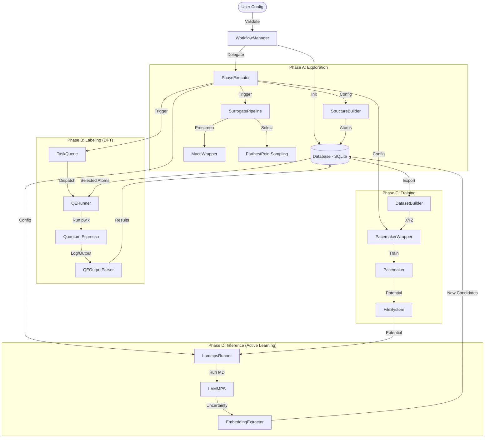

# MLIP-AutoPipe Architecture

## System Overview

MLIP-AutoPipe is an automated pipeline designed to generate atomic structures, screen them using surrogate models, validate them with Density Functional Theory (DFT), train Machine Learning Interatomic Potentials (MLIPs), and perform active learning cycles.

## Component Interaction Diagram

## Component Details

### 1. Configuration (`mlip_autopipec.config`)
-   **Role**: Source of Truth.
-   **Key Models**: `MLIPConfig` (Root), `DFTConfig`, `TrainingConfig`, `InferenceConfig`.
-   **Validation**: Strict Pydantic schemas enforce type safety and logical constraints (e.g., non-negative temperatures).

### 2. Core Database (`mlip_autopipec.core.database`)
-   **Role**: Central Persistence Layer.
-   **Implementation**: Abstraction over `ase.db` (SQLite).
-   **Features**:
    -   **Validation**: Ensures `ase.Atoms` integrity (no NaNs, valid cells) before insertion.
    -   **Atomic Operations**: Transactions for metadata updates.
    -   **Connection Management**: `DatabaseConnector` handles lifecycle.

### 3. Orchestration (`mlip_autopipec.orchestration`)
-   **WorkflowManager**: State machine managing the active learning loop (Generation -> DFT -> Training -> Inference).
-   **PhaseExecutor**: Facade that isolates the logic for executing each phase, delegating to specialized runners.
-   **TaskQueue**: Manages distributed execution via Dask (future-proof).

### 4. DFT Factory (`mlip_autopipec.dft`)
-   **QERunner**: Secure execution of Quantum Espresso. Handles timeout and basic recovery.
-   **RecoveryHandler**: Implements strategies to fix convergence failures (e.g., reducing mixing beta).

### 5. Training Module (`mlip_autopipec.training`)
-   **PacemakerWrapper**: Automates the `pacemaker` training tool.
    -   **Input**: Generates validated `input.yaml` from `TrainingConfig`.
    -   **Execution**: Runs subprocess safely.
    -   **Output**: Parses logs for RMSE metrics.

### 6. Inference & Active Learning (`mlip_autopipec.inference`)
-   **LammpsRunner**: Runs MD simulations with uncertainty monitoring.
    -   **Security**: Validates executable paths and prevents shell injection.
-   **EmbeddingExtractor**: Extracts local environments from high-uncertainty configurations to seed the next generation.

## Security & Robustness
-   **Subprocess Safety**: All external binaries (QE, LAMMPS, Pacemaker) are executed with `shell=False` and fully resolved paths. Arguments are passed as lists.
-   **Data Integrity**: `DatabaseManager` strictly validates inputs. Configuration files are generated and validated before use.
-   **Error Handling**: Comprehensive exception handling in runners prevents pipeline crashes from individual job failures.
