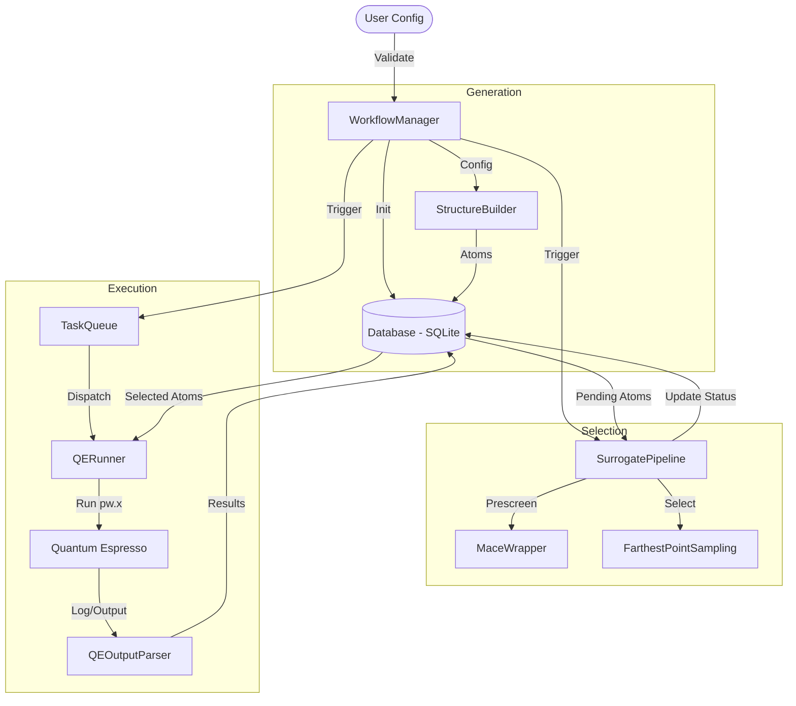

# MLIP-AutoPipe Architecture

## System Overview

MLIP-AutoPipe is an automated pipeline designed to generate atomic structures, screen them using surrogate models, and validate them with Density Functional Theory (DFT) to create training datasets for Machine Learning Interatomic Potentials (MLIPs).

## Data Flow Diagram

## Component Details

### 1. Configuration (`mlip_autopipec.config`)
-   **Role**: Defines the schema for all system inputs using Pydantic.
-   **Key Models**:
    -   `MLIPConfig`: Root configuration.
    -   `DFTConfig`: Parameters for Quantum Espresso (cutoff, k-points, etc.).
    -   `GeneratorConfig`: Settings for SQS and defects.
-   **Validation**: Strict typing and validation logic (e.g., directory existence checks) ensure fail-fast behavior.

### 2. Core Database (`mlip_autopipec.core.database`)
-   **DatabaseConnector**:
    -   **Responsibility**: Manages the SQLite connection lifecycle (open/close) and file creation.
    -   **Pattern**: Context Manager.
-   **DatabaseManager**:
    -   **Responsibility**: Provides high-level CRUD operations (`add_structure`, `get_atoms`, `update_metadata`).
    -   **Abstraction**: Hides the details of `ase.db` from the rest of the application.
    -   **Error Handling**: Wraps low-level SQL/OS errors into `DatabaseError`.

### 3. DFT Factory (`mlip_autopipec.dft`)
-   **QERunner**:
    -   **Role**: Orchestrates the execution of DFT calculations.
    -   **Features**: Auto-recovery loop, secure command execution (no shell), timeout management.
-   **InputGenerator**:
    -   **Role**: Converts atomic structures and config parameters into `pw.in` files.
    -   **Physics**: Auto-calculates K-grid based on `kspacing`.
-   **RecoveryHandler**:
    -   **Role**: Analyzes stdout/stderr for specific error patterns (e.g., convergence failure).
    -   **Logic**: Implements a "Recovery Ladder" (e.g., Reduce Beta -> Change Solver -> Increase Temp).

### 4. Surrogate Module (`mlip_autopipec.surrogate`)
-   **SurrogatePipeline**:
    -   **Role**: Driver for the active learning cycle.
    -   **Logic**: Rejects unphysical structures (high forces) and samples diverse ones.
-   **MaceWrapper**: Adapter for the MACE foundation model.

## Security & Robustness
-   **Subprocess Safety**: External commands (QE, LAMMPS) are executed with `shell=False` and validated argument lists to prevent injection.
-   **Data Integrity**: Inputs are validated against strict schemas. Outputs (Forces, Stress) are checked for NaNs and shape consistency.
-   **Error Handling**: Custom exception hierarchy (`DFTFatalError`, `DatabaseError`) allows for targeted recovery or graceful shutdown.
