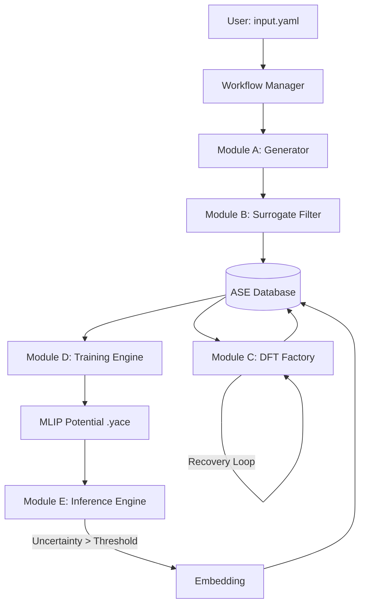

# MLIP-AutoPipe: The "Zero-Human" Protocol


> **Automated Active Learning for Exascale Materials Discovery.**
> MLIP-AutoPipe is an autonomous pipeline that generates, trains, and validates Machine Learning Interatomic Potentials (MLIPs) with zero human intervention, bridging the gap between DFT accuracy and MD scalability.

## Key Features

-   **Surrogate-First Exploration**: Uses pre-trained foundation models (MACE-MP) to scout millions of candidate structures and select only the most information-rich samples for expensive DFT calculations.
-   **Autonomous DFT Factory**: A robust Quantum Espresso wrapper that automatically detects crashes (convergence failures, diagonalization errors) and applies heuristic recovery strategies to fix them.
-   **Active Learning Loop**: Decoupled inference engine that runs massive MD simulations, pauses when uncertainty is high, and extracts "Periodic Embedded" clusters for refinement.
-   **Physics-Informed Generation**: Generates initial datasets using SQS (alloys), Normal Mode Sampling (molecules), and Defect Engineering (vacancies/interstitials) without needing AIMD.
-   **Zero-Config**: Driven by a single `input.yaml` file. No shell scripts, no manual job submission.

## Architecture Overview

The system is composed of five modular engines orchestrated by a central workflow manager.



## Prerequisites

-   **Python 3.11+**
-   **uv** (Recommended package manager) or pip
-   **Quantum Espresso** (`pw.x`) installed and in PATH
-   **Pacemaker** installed for training
-   **LAMMPS** installed with `pair_style pace` for inference

## Installation

1.  Clone the repository:
    ```bash
    git clone https://github.com/organization/mlip_autopipec.git
    cd mlip_autopipec
    ```

2.  Install dependencies using `uv`:
    ```bash
    uv sync
    ```
    Or using pip:
    ```bash
    pip install -e .
    ```

3.  Set up environment variables (optional):
    ```bash
    export MLIP_LOG_LEVEL=INFO
    ```

## Usage

### 1. Initialize a Project
Create a new directory and generate a template configuration.

```bash
mkdir my_alloy
cd my_alloy
mlip-auto init
```

### 2. Configure
Edit `input.yaml` to define your system (e.g., Al-Cu alloy) and resources.

```yaml
project_name: "AlCu_SolidSolution"
target_system:
  elements: ["Al", "Cu"]
  structure: "fcc"
dft:
  command: "mpirun -np 32 pw.x"
```

### 3. Run the Loop
Start the autonomous process.

```bash
mlip-auto loop
```

The system will:
1.  Generate initial structures.
2.  Screen them with MACE.
3.  Run DFT calculations.
4.  Train the initial potential.
5.  Run MD to find defects/failures.
6.  Repeat until convergence.

## Development Workflow

We follow a strict Cycle-based development process (Cycles 01-08).

### Running Tests
```bash
pytest
```

### Linting & Formatting
We enforce strict typing and style rules.
```bash
ruff check .
mypy .
```

## Project Structure

```ascii
mlip_autopipec/
├── app.py                      # CLI Entrypoint
├── config/                     # Pydantic Schemas
├── data_models/                # ASE Atoms & DB Wrappers
├── generator/                  # Module A: Structure Generation
├── surrogate/                  # Module B: MACE & FPS
├── dft/                        # Module C: Quantum Espresso Runner
├── training/                   # Module D: Pacemaker Wrapper
├── inference/                  # Module E: LAMMPS & Uncertainty
└── orchestration/              # Workflow Logic
```

## License

MIT License. See `LICENSE` for details.
