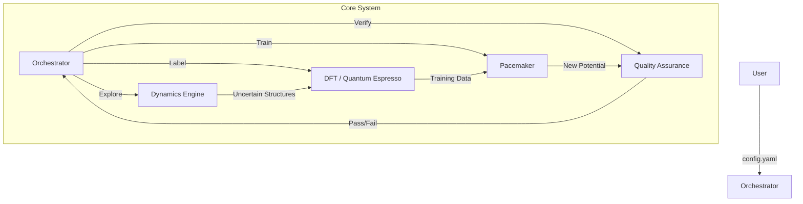

# PYACEMAKER: Automated MLIP Construction System


**PYACEMAKER** (Python Atomic Cluster Expansion Maker) is a "Zero-Config" autonomous system for creating State-of-the-Art Machine Learning Interatomic Potentials (MLIPs). It democratizes computational materials science by automating the complex workflow of data generation, quantum mechanical labeling (DFT), model training (Pacemaker), and validation.

> **Elevator Pitch:** "Give us the elements (e.g., Fe, Pt), and we give you a physics-robust, production-ready interatomic potential that spans from femtoseconds (MD) to hours (kMC)."

---

## 🚀 Key Features

*   **Zero-Config Workflow**: Define your material system in a single `config.yaml`. The system handles DFT parameters, k-points, and training hyperparameters automatically.
*   **Active Learning Loop**: Instead of random sampling, the system runs MD simulations to *find* the structures it doesn't understand ("Uncertainty-Driven Exploration"), labeling only what matters.
*   **Physics-Informed Robustness**: Implements **Delta Learning**, correcting a robust physical baseline (ZBL/LJ) rather than learning from scratch. This prevents "exploding" simulations in high-energy regimes.
*   **Scale-Up Ready**: Seamlessly integrates **LAMMPS** for molecular dynamics and **EON** for Adaptive Kinetic Monte Carlo (aKMC), allowing you to study rare events and long-term evolution.

---

## 🏗️ Architecture Overview

The system operates on a Hub-and-Spoke model, orchestrated by a central brain that manages the lifecycle of the potential.



---

## 🛠️ Prerequisites

*   **Python**: >= 3.12
*   **Package Manager**: `uv` (Recommended) or `pip`
*   **External Tools** (for Real Mode):
    *   Quantum Espresso (`pw.x`)
    *   LAMMPS (`lmp_serial` or `lmp_mpi`) with USER-PACE package
    *   Pacemaker Suite (`pace_train`, `pace_collect`)

---

## 📦 Installation & Setup

1.  **Clone the Repository**
    ```bash
    git clone https://github.com/your-org/mlip-pipeline.git
    cd mlip-pipeline
    ```

2.  **Initialize Environment (using uv)**
    ```bash
    uv sync
    ```

3.  **Configure Environment**
    Copy the example configuration (if available) or create your own.
    ```bash
    cp config.yaml.example config.yaml
    ```

---

## 🏃 Usage

### Quick Start (CLI)

To start the automated pipeline:

```bash
uv run mlip-pipeline run --config config.yaml
```

To resume a stopped run:

```bash
uv run mlip-pipeline run --config config.yaml --resume
```

### Tutorials

We provide Jupyter Notebooks to guide you through scientific workflows:
*   `tutorials/01_MgO_FePt_Training.ipynb`: Learn how to train a potential for a multicomponent system.
*   `tutorials/02_Deposition_and_Ordering.ipynb`: Run MD deposition and kMC ordering simulations.

---

## 💻 Development Workflow

This project follows a strict **Schema-First, Test-Driven** development cycle.

### Running Tests
```bash
uv run pytest
```

### Linting & Formatting
We use `ruff` and `mypy` to enforce code quality.
```bash
uv run ruff check .
uv run mypy .
```

---

## 📂 Project Structure

```
mlip-pipeline/
├── config.yaml               # Main configuration file
├── dev_documents/            # Detailed Specifications & UATs
│   ├── system_prompts/       # Cycle-by-Cycle Specs
│   └── FINAL_UAT.md          # Tutorial Plan
├── src/
│   └── mlip_autopipec/       # Source Code
│       ├── main.py           # CLI Entry Point
│       ├── orchestration/    # The Brain
│       ├── interfaces/       # Abstract Base Classes
│       └── infrastructure/   # Adapters for QE, LAMMPS, etc.
├── tests/                    # Unit and End-to-End Tests
└── tutorials/                # Jupyter Notebooks
```

---

## 📄 License

This project is licensed under the MIT License - see the [LICENSE](LICENSE) file for details.
