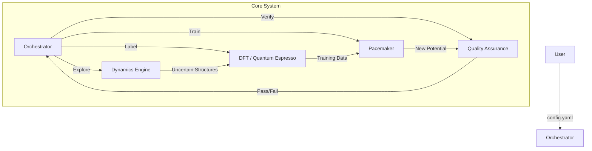

# PYACEMAKER: Automated MLIP Construction System


**PYACEMAKER** (Python Atomic Cluster Expansion Maker) is a "Zero-Config" autonomous system for creating State-of-the-Art Machine Learning Interatomic Potentials (MLIPs). It democratizes computational materials science by automating the complex workflow of data generation, quantum mechanical labeling (DFT), model training (Pacemaker), and validation.

> **Elevator Pitch:** "Give us the elements (e.g., Fe, Pt), and we give you a physics-robust, production-ready interatomic potential that spans from femtoseconds (MD) to hours (kMC)."

---

## 🚀 Key Features

*   **Mock Mode**: Fully functional simulation of the pipeline flow using mock components, allowing verification of the orchestration logic without external heavy dependencies.
*   **Oracle Module**: Integrated support for **Quantum Espresso (DFT)** with:
    *   **Self-Healing**: Automatically retries failed calculations by adjusting SCF parameters (mixing beta, smearing).
    *   **Streaming I/O**: Processes structures one-by-one to handle massive datasets without memory crashes.
    *   **Security**: Validates input commands to prevent shell injection.
*   **Zero-Config Workflow**: Define your material system in a single `config.yaml`. The system handles orchestration automatically.
*   **Modular Architecture**: Plug-and-play interfaces for Explorer, Oracle, Trainer, and Validator components.
*   **Strict Type Safety**: Built with Pydantic and Type Hints for maximum reliability.

---

## 🏗️ Architecture Overview

The system operates on a Hub-and-Spoke model, orchestrated by a central brain that manages the lifecycle of the potential.



---

## 🛠️ Prerequisites

*   **Python**: >= 3.12
*   **Package Manager**: `uv` (Recommended) or `pip`
*   **Quantum Espresso**: (Optional) Required if using `type: espresso` for Oracle. Ensure `pw.x` is in your PATH.

---

## 📦 Installation & Setup

1.  **Clone the Repository**
    ```bash
    git clone https://github.com/your-org/mlip-pipeline.git
    cd mlip-pipeline
    ```

2.  **Initialize Environment (using uv)**
    ```bash
    uv sync
    uv pip install -e .
    ```

3.  **Configure Environment**
    Create a configuration file:
    ```yaml
    # config.yaml
    work_dir: "./_work"
    max_cycles: 5
    random_seed: 42

    explorer:
      type: "mock"

    oracle:
      type: "espresso"
      command: "mpirun -np 4 pw.x"
      pseudo_dir: "/path/to/pseudos"
      pseudopotentials:
        Si: "Si.upf"
      kspacing: 0.04
      batch_size: 10

    trainer:
      type: "mock"
    ```

---

## 🏃 Usage

### Quick Start (CLI)

To start the automated pipeline:

```bash
uv run mlip-pipeline run --config config.yaml
```

Output should show the progression of cycles (Explorer -> Oracle -> Trainer -> Validator).

---

## 💻 Development Workflow

This project follows a strict **Schema-First, Test-Driven** development cycle.

### Running Tests
```bash
uv run pytest
```

### Linting & Formatting
We use `ruff` and `mypy` to enforce code quality.
```bash
uv run ruff check .
uv run mypy .
```

---

## 📂 Project Structure

```
mlip-pipeline/
├── config.yaml               # Main configuration file (example)
├── dev_documents/            # Detailed Specifications & UATs
├── src/
│   └── mlip_autopipec/       # Source Code
│       ├── main.py           # CLI Entry Point
│       ├── orchestration/    # The Brain
│       ├── interfaces/       # Abstract Base Classes
│       ├── infrastructure/   # Adapters (Mock, Espresso)
│       └── config/           # Pydantic Configuration Models
└── tests/                    # Unit and End-to-End Tests
```

---

## 📄 License

This project is licensed under the MIT License - see the [LICENSE](LICENSE) file for details.
