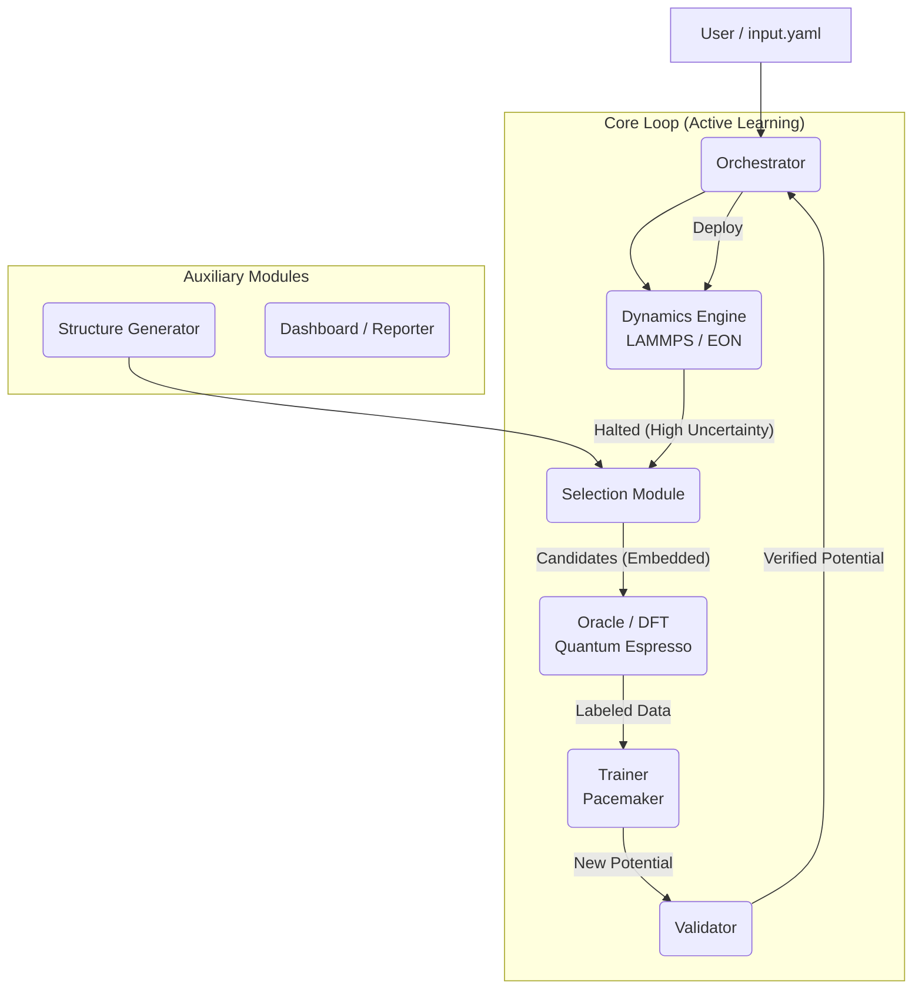

# PyAcemaker: Automated MLIP Construction System


**PyAcemaker** is a "Zero-Config" automated system for constructing "State-of-the-Art" Machine Learning Interatomic Potentials (MLIPs). Built on top of the **Pacemaker** (Atomic Cluster Expansion) engine, it utilizes an autonomous Active Learning workflow to generate physically robust potentials with minimal user intervention.

> **Goal:** Democratize high-accuracy atomistic simulations by removing the need for deep expertise in data science and computational physics.

## Key Features

*   **Zero-Config Automation**: A single `input.yaml` drives the entire pipeline—from initial structure generation to final potential deployment.
*   **Active Learning (Data Efficiency)**: Reduces DFT costs by >90% using D-Optimality (Active Set) selection and real-time uncertainty monitoring ($\gamma$-watchdog).
*   **Physics-Informed Robustness**: Enforces **Hybrid Potentials** (ACE + ZBL/LJ) to prevent physical violations (e.g., core collapse) and ensures stability via Phonon and Elasticity validation.
*   **Self-Healing Oracle**: Automated DFT execution (Quantum Espresso) with built-in error recovery for SCF convergence failures.
*   **Scalability**: Modular design supporting deployment from local workstations to HPC clusters.

## Architecture Overview

PyAcemaker follows a Hub-and-Spoke architecture with a central **Orchestrator** managing specialized agents.



## Prerequisites

*   **Python**: 3.10 or higher
*   **Package Manager**: `uv` (recommended) or `pip`
*   **External Tools**:
    *   **Quantum Espresso** (`pw.x`) for DFT calculations.
    *   **LAMMPS** (`lmp`) with USER-PACE package for MD simulations.
    *   **Pacemaker** (`pace_train`, `pace_collect`) for potential training.

## Installation

1.  **Clone the repository**:
    ```bash
    git clone https://github.com/your-org/pyacemaker.git
    cd pyacemaker
    ```

2.  **Install dependencies using `uv`**:
    ```bash
    uv sync
    ```
    *Alternatively, with pip:* `pip install -e .`

3.  **Set up environment**:
    Copy the example environment file (if available) or ensure `pw.x` and `lmp` are in your PATH.

## Usage

### Quick Start

1.  **Initialize a project**:
    Generate a default configuration file (`input.yaml`).
    ```bash
    mlip-auto init
    ```

2.  **Configure**:
    Edit `input.yaml` to specify your target system (e.g., elements, crystal structure) and paths to executables.

3.  **Run the pipeline**:
    Start the autonomous loop:
    ```bash
    mlip-auto run
    ```
    *Or explicitly:*
    ```bash
    mlip-auto run loop --config input.yaml
    ```

4.  **Monitor**:
    Open `report.html` (future feature) to watch the active learning progress and validation metrics.
    Logs are written to `mlip.log`.

## Development Workflow

### Running Tests
We use `pytest` for unit and integration testing.
```bash
uv run pytest
```

### Linting & Formatting
We strictly enforce code quality using `ruff` and `mypy`.
```bash
uv run ruff check .
uv run mypy .
```

### Project Structure

```ascii
src/mlip_autopipec/
├── app.py                  # CLI Entry Point
├── orchestration/          # Main workflow logic
├── config/                 # Pydantic Schemas
├── data_models/            # Domain Models
├── modules/                # CLI Handlers
└── utils/                  # Utilities
dev_documents/              # System Prompts & Specifications
tests/                      # Test Suite
```

## License

MIT License. See `LICENSE` for details.
