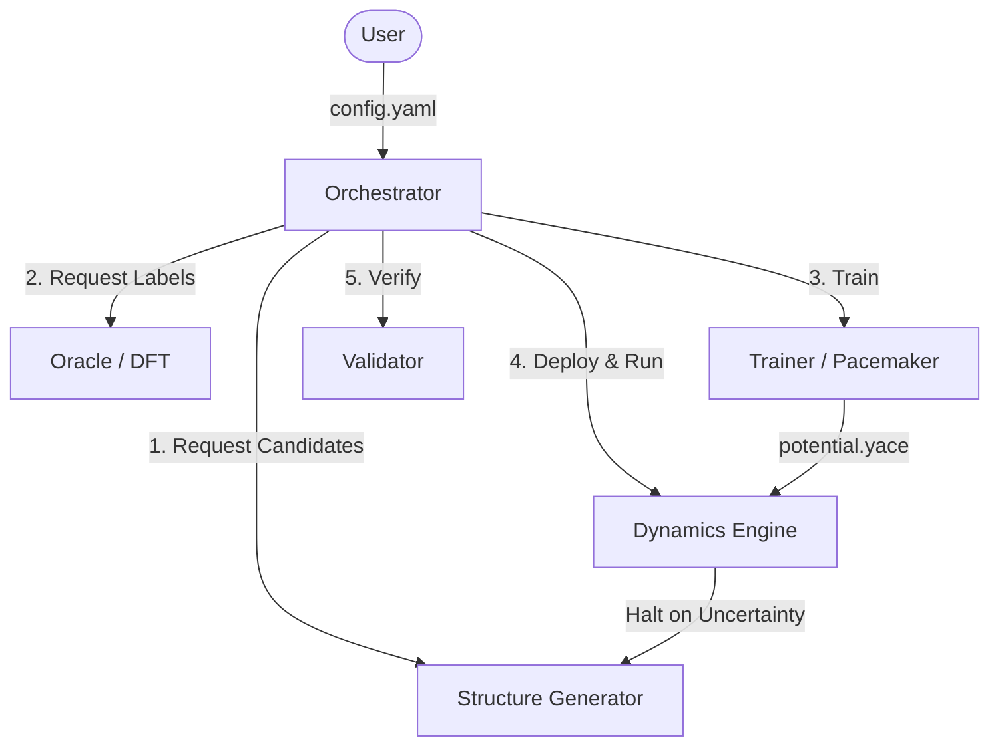

# PYACEMAKER: High Efficiency MLIP Construction System


**PYACEMAKER** is an autonomous research agent designed to "democratise" the construction of state-of-the-art Machine Learning Interatomic Potentials (MLIP). By orchestrating a closed-loop active learning cycle involving Adaptive Sampling, Self-Healing DFT calculations, and Uncertainty-Driven Molecular Dynamics, it allows researchers to generate robust ACE potentials with zero manual intervention.

## Key Features

*   **Zero-Config Workflow**: Start a complex active learning campaign with a single YAML file. No Python scripting required.
*   **Self-Healing Oracle**: Automatically detects and fixes DFT convergence errors (Quantum Espresso/VASP), ensuring high-throughput reliability.
*   **Physical Robustness**: Enforces "Delta Learning" against physical baselines (ZBL/LJ) and validates potentials using phonon stability and elastic constants.
*   **Time-Scale Bridging**: Seamlessly integrates Molecular Dynamics (LAMMPS) and Adaptive Kinetic Monte Carlo (EON) to explore both fast vibrations and slow diffusion events.
*   **Data Efficiency**: Utilizes D-Optimality (MaxVol) selection to achieve SOTA accuracy with 1/10th the training data of random sampling.

## Architecture Overview

The system operates as an event-driven loop where the **Orchestrator** manages the flow of data between the Explorer (Generator), Judge (Oracle), Learner (Trainer), and Runner (Dynamics).



## Prerequisites

*   **Python**: 3.11 or higher
*   **Package Manager**: `uv` (recommended) or `pip`
*   **External Engines**:
    *   Quantum Espresso (`pw.x`) for DFT labeling.
    *   LAMMPS (`lmp`) with `USER-PACE` package for MD.
    *   Pacemaker (`pace_train`) for potential fitting.
    *   EON (`eonclient`) for kMC (optional).

## Installation

1.  **Clone the repository**:
    ```bash
    git clone https://github.com/example/pyacemaker.git
    cd pyacemaker
    ```

2.  **Install dependencies**:
    ```bash
    # Using uv (Recommended)
    uv sync

    # Using pip
    pip install -e .[dev]
    ```

3.  **Configure Environment**:
    Copy the example configuration and adjust paths to your local executables.
    ```bash
    cp config.example.yaml config.yaml
    ```

## Usage

### Quick Start
To run a test simulation (using Mock components if binaries are missing):

```bash
mlip-runner run config.yaml
```

### Running Tutorials
We provide Jupyter Notebooks to guide you through real-world scenarios.

1.  **Training FePt on MgO**:
    ```bash
    jupyter notebook tutorials/01_MgO_FePt_Training.ipynb
    ```
2.  **Deposition & Ordering**:
    ```bash
    jupyter notebook tutorials/02_Deposition_and_Ordering.ipynb
    ```

## Development Workflow

The project follows a strict 8-cycle implementation plan.

### Running Tests
```bash
# Run all tests
pytest

# Run tests for a specific cycle (e.g., Cycle 01)
pytest tests/cycle01/
```

### Code Quality
We enforce strict typing and linting.
```bash
# Check code style
ruff check .

# Check types
mypy src
```

## Project Structure

```text
pyacemaker/
├── src/mlip_autopipec/      # Source code
│   ├── core/                # Orchestrator & State Management
│   ├── components/          # Generator, Oracle, Trainer, Dynamics, Validator
│   └── domain_models/       # Pydantic Configs & Enums
├── dev_documents/           # Specifications & UATs
│   ├── system_prompts/      # Cycle-specific docs
│   └── FINAL_UAT.md         # Master Test Plan
├── tutorials/               # Jupyter Notebooks
├── tests/                   # Unit & Integration Tests
└── pyproject.toml           # Build & Linter Config
```

## License

This project is licensed under the MIT License.
