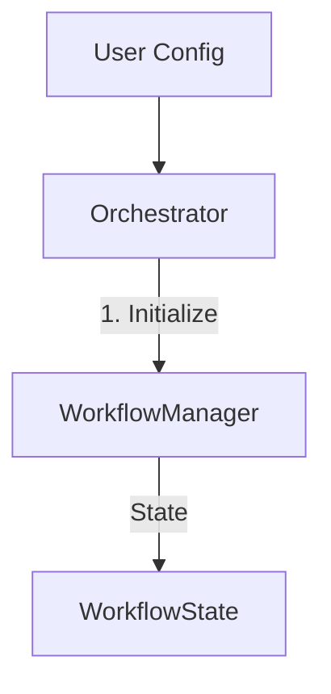

# PYACEMAKER: Automated MLIP Pipeline

  

**PYACEMAKER** is a fully automated, "Zero-Config" system for constructing and operating State-of-the-Art Machine Learning Interatomic Potentials (MLIP) using the Pacemaker (ACE) engine. It democratizes computational materials science by enabling researchers to generate robust, physics-informed potentials without needing deep expertise in machine learning or DFT.

## Key Features

*   **Zero-Config Workflow**: Define your material in a single YAML file.
*   **CLI Tools**: Project initialization (`init`), configuration validation (`check`), and loop execution (`run-loop`).
*   **Robust Configuration**: Strict schema validation for all inputs using Pydantic.
*   **State Management**: Automatic persistence of workflow state (`workflow_state.json`) to handle interruptions.
*   **Infrastructure**: Centralized logging and safe I/O operations.
*   **Active Learning Loop**: (Skeleton) Framework for "On-the-Fly" (OTF) learning cycle.

## Architecture Overview

The system is orchestrated by a central controller that manages a closed-loop cycle of Exploration, Oracle labeling, Training, and Validation.



## Prerequisites

*   **Python**: 3.12 or higher
*   **Package Manager**: `uv` (recommended) or `pip`

## Installation & Setup

1.  **Clone the repository**:
    ```bash
    git clone https://github.com/your-org/mlip-autopipec.git
    cd mlip-autopipec
    ```

2.  **Install dependencies**:
    Using `uv`:
    ```bash
    uv sync
    ```
    Or using `pip`:
    ```bash
    pip install -e .[dev]
    ```

## Usage

### Quick Start

1.  **Initialize a new project**:
    ```bash
    uv run mlip-auto init
    ```
    This creates a `config.yaml` in your current directory.

2.  **Edit Configuration**:
    Open `config.yaml` and set your target parameters.

3.  **Run the Active Learning Loop**:
    ```bash
    uv run mlip-auto run-loop
    ```
    The system will initialize the workflow and log the start of the process.

## Development Workflow

This project follows a strict development cycle.

*   **Run Tests**:
    ```bash
    uv run pytest
    ```

*   **Linting & Type Checking**:
    The project enforces strict code quality using `ruff` and `mypy`.
    ```bash
    uv run ruff check .
    uv run mypy .
    ```

## Project Structure

```ascii
src/mlip_autopipec/
├── app.py                      # CLI Entry Point
├── constants.py                # Global Constants
├── cli/                        # CLI Commands
├── domain_models/              # Pydantic Schemas (Config, Structure, Workflow)
├── infrastructure/             # Infrastructure (Logging, IO)
└── orchestration/              # Core Logic (Workflow Manager)
```

## License

This project is licensed under the MIT License.
