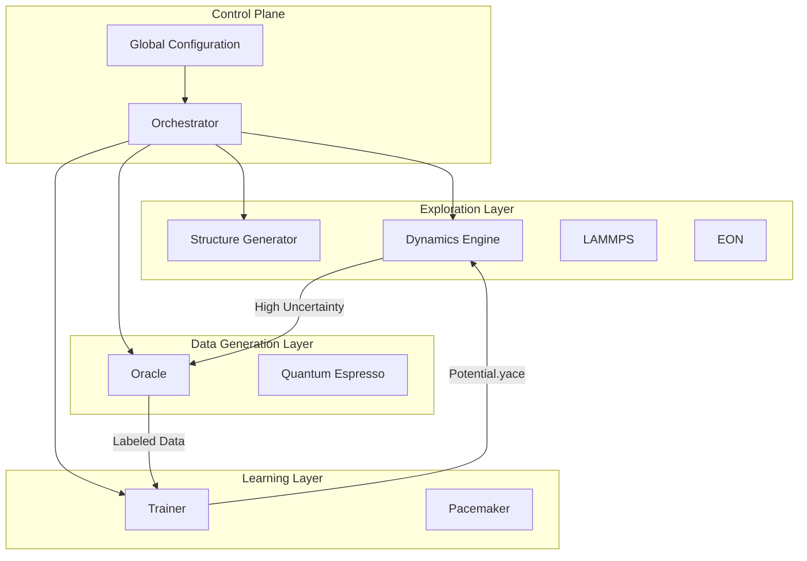

# PYACEMAKER: Automated MLIP Construction System


**PYACEMAKER** is an autonomous "Robot Scientist" for materials physics. It automates the construction of State-of-the-Art Machine Learning Interatomic Potentials (MLIPs) using the Atomic Cluster Expansion (ACE) formalism. By integrating Active Learning, Density Functional Theory (DFT) automation, and Physics-Informed constraints, it enables researchers to generate robust potentials for complex alloys with **Zero Configuration**.

> **Elevator Pitch:** "Input a chemical composition, get a production-ready, validated interatomic potential in days, not months—without writing a single line of code."

## Key Features

*   **Zero-Config Workflow**: A single YAML file drives the entire process from initial structure generation to final validation.
*   **Self-Healing Oracle**: Automated interface to Quantum Espresso that detects SCF convergence failures and automatically adjusts parameters to recover calculations.
*   **Physics-Informed Robustness**: Strictly enforces a physical baseline (Lennard-Jones/ZBL) via Delta Learning, preventing non-physical behavior and simulation crashes in high-energy regimes.
*   **Active Learning Loop**: Uses uncertainty quantification ($\gamma$) to autonomously explore the phase space, detecting and labeling only the most informative structures.
*   **Time-Scale Bridging**: Seamlessly integrates Molecular Dynamics (LAMMPS) and Kinetic Monte Carlo (EON) to explore both fast vibrations and slow diffusion events.

## Architecture Overview

PYACEMAKER follows a **Hub-and-Spoke** architecture orchestrated by a central Python controller.



## Prerequisites

*   **Python 3.12+**
*   **uv** (Fast Python package manager)
*   **LAMMPS** (with USER-PACE package installed)
*   **Quantum Espresso** (`pw.x` accessible in PATH)
*   **Pacemaker** (Python library and executables)

## Installation & Setup

1.  **Clone the Repository**
    ```bash
    git clone https://github.com/your-org/pyacemaker.git
    cd pyacemaker
    ```

2.  **Initialize Environment (using uv)**
    ```bash
    uv sync
    ```

3.  **Prepare Environment Variables**
    ```bash
    cp .env.example .env
    # Edit .env to set paths to external binaries if necessary
    ```

## Usage

### Quick Start
To run a test cycle using the "Mock" backend (no external dependencies required):

1.  Create a configuration file `config.yaml`:
    ```yaml
    work_dir: "./simulation_runs/test_run"
    max_cycles: 3
    oracle:
      type: "mock"
    trainer:
      type: "mock"
    explorer:
      type: "mock"
    ```

2.  Run the orchestrator:
    ```bash
    uv run python -m mlip_autopipec.main config.yaml
    ```

## Development Workflow

This project enforces strict code quality standards.

### Running Tests
```bash
uv run pytest
```

### Linting & Type Checking
We use `ruff` for linting and `mypy` for strict type checking.
```bash
uv run ruff check .
uv run mypy .
```

### Cycle-Based Development
The implementation is divided into 8 Cycles. See `dev_documents/system_prompts/SYSTEM_ARCHITECTURE.md` for the detailed roadmap.

## Project Structure

```ascii
src/
└── mlip_autopipec/
    ├── config/             # Pydantic configuration models
    ├── domain_models/      # Core data structures (Dataset, Potential)
    ├── infrastructure/     # Adapters for external tools (QE, LAMMPS)
    ├── interfaces/         # Abstract Base Classes
    ├── main.py             # CLI Entry Point
    └── utils/              # Logging and File I/O
dev_documents/
    ├── ALL_SPEC.md         # Full requirements
    ├── SYSTEM_ARCHITECTURE.md # Master architectural document
    └── system_prompts/     # Cycle-specific specifications
tests/                      # Unit and Integration tests
```

## License

MIT License. See `LICENSE` for details.
