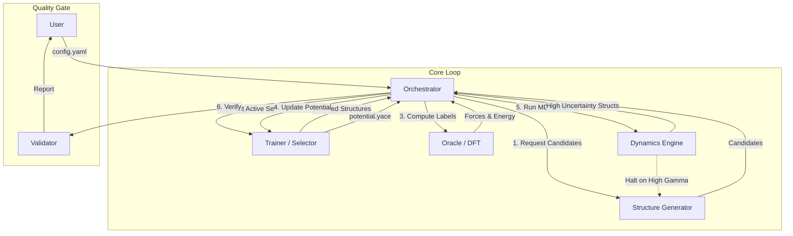

# PYACEMAKER: Automated MLIP Construction Pipeline


**PYACEMAKER** is an autonomous system for creating "State-of-the-Art" Machine Learning Interatomic Potentials (MLIP) using the Atomic Cluster Expansion (ACE) formalism. It democratizes atomistic simulations by allowing users with minimal expertise to generate robust, high-accuracy potentials from scratch with a "Zero-Config" workflow.

---

## 🚀 Key Features

*   **Zero-Config Workflow**: Define your elements in a single `config.yaml`, and let the system handle sampling, DFT calculations, training, and validation autonomously.
*   **Active Learning Loop**: Intelligently samples the chemical space using Uncertainty Quantification (Extrapolation Grade $\gamma$) to minimize expensive DFT calculations while maximizing accuracy.
*   **Physics-Informed Robustness**: Automatically enforces core-repulsion using Delta Learning (LJ/ZBL baselines) to prevent unphysical atomic overlap during high-energy MD events.
*   **Self-Healing Oracle**: The DFT manager automatically detects convergence failures and adjusts parameters (mixing beta, smearing) to recover without human intervention.
*   **Scalable Architecture**: Designed as a micro-component system (Orchestrator, Oracle, Trainer, Dynamics) that scales from a laptop to HPC clusters.

---

## 🏗️ Architecture Overview

The system follows a modular architecture orchestrated by a central Python controller.



---

## 🛠️ Prerequisites

*   **Python 3.12+**
*   **uv** (Universal Python Package Manager)
*   **Quantum Espresso** (`pw.x` in PATH) for DFT calculations.
*   **LAMMPS** (`lmp` in PATH) for Molecular Dynamics.
*   **Pacemaker** (`pace_train` in PATH) for training ACE potentials.

---

## 📦 Installation & Setup

1.  **Clone the Repository**
    ```bash
    git clone https://github.com/your-org/pyacemaker.git
    cd pyacemaker
    ```

2.  **Initialize Environment**
    ```bash
    uv sync
    ```

3.  **Prepare Configuration**
    Copy the example configuration:
    ```bash
    cp config.example.yaml config.yaml
    ```

---

## 💻 Usage

### Quick Start

Run the full pipeline using your configuration file:

```bash
uv run mlip-pipeline run config.yaml
```

### Validate an Existing Potential

Run physics checks (Phonons, Elastic Constants) on a trained potential:

```bash
uv run mlip-pipeline validate potential.yace --structure relaxed_structure.xyz
```

---

## 🔄 Development Workflow

The project follows a rigorous AC-CDD (Architect-Coder-Continuous-Delivery-Deployment) methodology with 6 implementation cycles.

### Running Tests
We use `pytest` for unit and integration testing:

```bash
uv run pytest
```

### Linting & Code Quality
We enforce strict type checking and linting:

```bash
# Type Checking
uv run mypy .

# Linting
uv run ruff check .
```

---

## 📂 Project Structure

```ascii
src/mlip_autopipec/
├── domain_models/          # Pydantic Models (Data Layer)
├── interfaces/             # Abstract Base Classes
├── infrastructure/         # Implementations (Oracle, Trainer, etc.)
├── orchestrator/           # Logic Layer (The Brain)
├── factory.py              # Dependency Injection
└── main.py                 # CLI Entrypoint

dev_documents/
├── system_prompts/         # Cycle Specifications & UATs
├── ALL_SPEC.md             # Master Requirements
└── FINAL_UAT.md            # Master Test Plan
```

---

## 📄 License

This project is licensed under the MIT License - see the LICENSE file for details.
