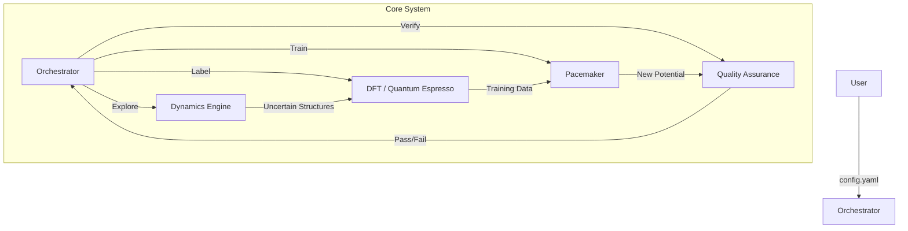

# PYACEMAKER: Automated MLIP Construction System


**PYACEMAKER** (Python Atomic Cluster Expansion Maker) is a "Zero-Config" autonomous system for creating State-of-the-Art Machine Learning Interatomic Potentials (MLIPs). It democratizes computational materials science by automating the complex workflow of data generation, quantum mechanical labeling (DFT), model training (Pacemaker), and validation.

> **Elevator Pitch:** "Give us the elements (e.g., Fe, Pt), and we give you a physics-robust, production-ready interatomic potential that spans from femtoseconds (MD) to hours (kMC)."

---

## 🚀 Key Features

*   **Zero-Config Workflow**: Define your material system in a single `config.yaml`. The system handles DFT parameters, k-points, and training hyperparameters automatically.
*   **Active Learning Loop**: Instead of random sampling, the system runs MD simulations to *find* the structures it doesn't understand ("Uncertainty-Driven Exploration"), labeling only what matters.
*   **Physics-Informed Robustness**: Implements **Delta Learning**, correcting a robust physical baseline (ZBL/LJ) rather than learning from scratch.
*   **Mock Mode Validation**: Verify the entire orchestration pipeline logic using mock components before deploying to expensive clusters.

---

## 🏗️ Architecture Overview

The system operates on a Hub-and-Spoke model, orchestrated by a central brain that manages the lifecycle of the potential.



---

## 🛠️ Prerequisites

*   **Python**: >= 3.12
*   **Package Manager**: `uv` (Recommended) or `pip`

---

## 📦 Installation & Setup

1.  **Clone the Repository**
    ```bash
    git clone https://github.com/your-org/mlip-pipeline.git
    cd mlip-pipeline
    ```

2.  **Initialize Environment**
    ```bash
    uv sync
    uv pip install -e .
    ```

---

## 🏃 Usage

### Basic Execution

To start the automated pipeline using the configuration file:

```bash
mlip-pipeline run --config config.yaml
```

### Example Configuration

Create a `config.yaml` file:

```yaml
work_dir: "./output"
max_cycles: 5
random_seed: 42
explorer:
  type: "mock"
oracle:
  type: "mock"
trainer:
  type: "mock"
```

### CLI Help

```bash
mlip-pipeline --help
mlip-pipeline run --help
```

---

## 📂 Project Structure

```
mlip-pipeline/
├── config.yaml               # Main configuration file
├── src/
│   └── mlip_autopipec/       # Source Code
│       ├── main.py           # CLI Entry Point
│       ├── config/           # Pydantic Schemas
│       ├── domain_models/    # Data Models (Structure, Dataset)
│       ├── orchestration/    # Active Learning Logic
│       ├── interfaces/       # Component Interfaces
│       └── infrastructure/   # Mocks and Adapters
├── tests/                    # Unit and End-to-End Tests
└── dev_documents/            # Detailed Specifications
```

---

## 📄 License

This project is licensed under the MIT License - see the [LICENSE](LICENSE) file for details.
