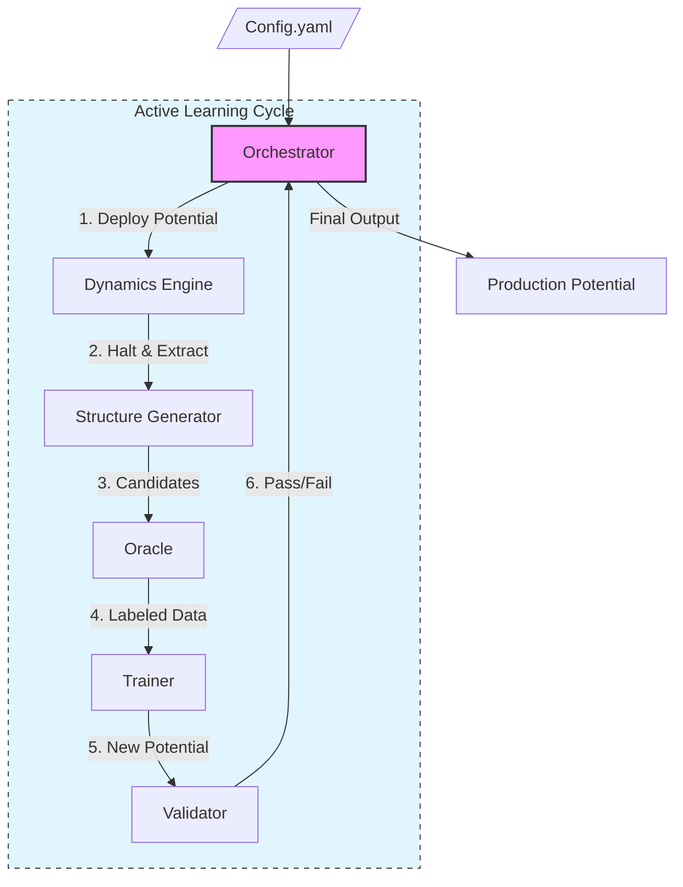

# MLIP Pipeline: Automated Machine Learning Interatomic Potential Construction


**Democratizing Atomic Simulations.** MLIP Pipeline is a high-efficiency system that allows researchers to construct "State-of-the-Art" Machine Learning Interatomic Potentials (MLIP) with minimal effort. By automating the entire lifecycle—from Active Learning and DFT calculations to validation and deployment—it enables complex simulations without requiring deep expertise in data science.

## 🚀 Key Features

*   **Zero-Config Workflow**: Define your material system in a single YAML file and let the autonomous agent handle the rest.
*   **Modular Architecture**: Pluggable components for Oracle (DFT), Trainer, Dynamics, and Generator.
*   **Strict Validation**: Robust data models ensure structural integrity and correct configuration using Pydantic.
*   **Mock Mode**: Develop and test pipelines instantly using simulated physics backends (Mock Oracle, Mock Trainer) without requiring heavy external codes.
*   **Scalable Design**: Uses lazy evaluation and iterators to handle large datasets without memory issues.

## 🏗️ Architecture Overview

The system follows a modular "Hub-and-Spoke" architecture orchestrated by a central Python controller.



## 📋 Prerequisites

*   **Python**: 3.12 or higher
*   **Package Manager**: `uv` (recommended) or `pip`

## 🛠️ Installation & Setup

1.  **Clone the repository**:
    ```bash
    git clone https://github.com/your-org/mlip-pipeline.git
    cd mlip-pipeline
    ```

2.  **Install dependencies**:
    Using `uv` (fastest):
    ```bash
    uv sync
    uv pip install -e .
    ```
    Or using `pip`:
    ```bash
    pip install -e .
    ```

3.  **Verify installation**:
    ```bash
    uv run pytest
    ```

## ⚡ Usage

### Quick Start (Mock Mode)

To verify the pipeline logic without running heavy physics codes:

1.  **Initialize a configuration**:
    ```bash
    uv run mlip-pipeline init --output config.yaml
    ```

2.  **Validate configuration**:
    ```bash
    uv run mlip-pipeline check-config config.yaml
    ```

3.  **Run the Pipeline**:
    ```bash
    uv run mlip-pipeline run config.yaml
    ```

## 💻 Development Workflow

This project enforces strict code quality standards.

*   **Linting**:
    ```bash
    uv run ruff check .
    uv run mypy .
    ```
*   **Testing**:
    ```bash
    uv run pytest --cov=src
    ```

### Project Structure

```ascii
src/mlip_autopipec/
├── domain_models/          # Pydantic Data Models (Structure, Potential)
├── interfaces/             # Abstract Base Classes (Oracle, Trainer)
├── infrastructure/         # Concrete Implementations (Mocks)
├── utils/                  # Utilities (Logging)
└── main.py                 # CLI Entry Point
```

## 📄 License

This project is licensed under the MIT License - see the [LICENSE](LICENSE) file for details.
