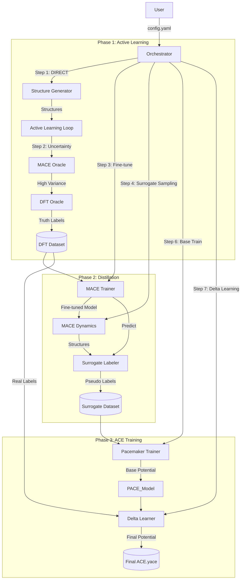

# PYACEMAKER

**Automated Machine Learning Interatomic Potential Construction System**


## Overview

**PYACEMAKER** is a next-generation pipeline designed to democratize the creation of high-accuracy Machine Learning Interatomic Potentials (MLIPs). It solves the "data efficiency" problem by leveraging **MACE Knowledge Distillation**. Instead of running thousands of expensive DFT calculations, PYACEMAKER uses a pre-trained Large Foundation Model (MACE-MP) as a "Teacher" to guide the exploration of chemical space and train a fast, production-ready "Student" potential (ACE/Pacemaker).

Ideally suited for materials scientists who need DFT-level accuracy with the speed of classical molecular dynamics.

## Key Features

-   **7-Step MACE Distillation**: A fully automated workflow that distills knowledge from MACE into a fast polynomial potential.
-   **Active Learning**: intelligently selects only the most critical structures for DFT calculation using uncertainty quantification, reducing computational cost by orders of magnitude.
-   **Delta Learning**: automatically corrects the "Sim-to-Real" gap by fine-tuning the potential on sparse high-fidelity DFT data.
-   **Zero-Config**: Define your system (e.g., `["Fe", "Pt"]`) in a single YAML file, and the Orchestrator handles the rest.
-   **Robust Validation**: Built-in physics checks ensure the generated potential is stable (Phonons) and physically reasonable (EOS).

## Architecture Overview

The system operates as a centralized Orchestrator managing specialized modules for Generation, Oracle evaluation (MACE/DFT), and Training.


```mermaid
graph TD
    User[User] -->|config.yaml| Orch[Orchestrator]

    subgraph "Phase 1: Active Learning"
        Orch -->|Step 1: DIRECT| Gen[Structure Generator]
        Gen -->|Structures| AL[Active Learning Loop]
        AL -->|Step 2: Uncertainty| MACE_O[MACE Oracle]
        MACE_O -->|High Variance| DFT[DFT Oracle]
        DFT -->|Truth Labels| DB[(DFT Dataset)]
    end

    subgraph "Phase 2: Distillation"
        Orch -->|Step 3: Fine-tune| MACE_T[MACE Trainer]
        DB --> MACE_T
        MACE_T -->|Fine-tuned Model| MACE_MD[MACE Dynamics]
        Orch -->|Step 4: Surrogate Sampling| MACE_MD
        MACE_MD -->|Structures| Label[Surrogate Labeler]
        MACE_T -->|Predict| Label
        Label -->|Pseudo Labels| S_DB[(Surrogate Dataset)]
    end

    subgraph "Phase 3: ACE Training"
        Orch -->|Step 6: Base Train| PACE_T[Pacemaker Trainer]
        S_DB --> PACE_T
        PACE_T -->|Base Potential| PACE_Model

        Orch -->|Step 7: Delta Learning| Delta[Delta Learner]
        DB -->|Real Labels| Delta
        PACE_Model --> Delta
        Delta -->|Final Potential| Final_ACE[(Final ACE.yace)]
    end
```

## Prerequisites

-   **Python 3.11+**
-   **uv** (Recommended for dependency management) or pip.
-   **MACE-MP-0** (automatically downloaded or provided via path).
-   **Pacemaker** (external binary or library).
-   **Optional**: VASP or Quantum Espresso for "Real Mode" execution.

## Installation & Setup

1.  **Clone the repository**:
    ```bash
    git clone https://github.com/your-org/pyacemaker.git
    cd pyacemaker
    ```

2.  **Install dependencies**:
    We use `uv` for fast dependency resolution.
    ```bash
    uv sync
    ```
    Or using pip:
    ```bash
    pip install .
    ```

3.  **Environment Setup**:
    Copy the example environment file (if available) or set necessary variables.
    ```bash
    export PYACEMAKER_MODE=MOCK  # For testing without DFT
    ```

## Usage

### Quick Start

1.  **Create a configuration file** (`config.yaml`):
    ```yaml
    system:
      elements: ["Ni", "Al"]
      base_directory: "./my_experiment"
    distillation:
      enable_mace_distillation: true
    ```

2.  **Run the pipeline**:
    ```bash
    uv run pyacemaker config.yaml
    ```

3.  **Monitor Progress**:
    The system will log its progress through the 7 steps. Check the `my_experiment` directory for artifacts like `dft_dataset.pckl` and `final_potential.yace`.

### Running Tutorials

To verify the installation and see the system in action (simulating an SN2 reaction):

```bash
uv run python tutorials/UAT_AND_TUTORIAL.py
```

## Development Workflow

This project follows a strict cycle-based development process.

### Running Tests
```bash
uv run pytest
```

### Linting & Formatting
We enforce strict code quality using `ruff` and `mypy`.
```bash
uv run ruff check .
uv run mypy .
```

## Project Structure

```text
pyacemaker/
├── dev_documents/          # Specs and Architecture docs
│   ├── system_prompts/     # Cycle 1-6 Specifications
│   └── USER_TEST_SCENARIO.md
├── src/
│   └── pyacemaker/         # Source code
│       ├── core/           # Base classes & Config
│       ├── oracle/         # MACE & DFT interfaces
│       ├── trainer/        # Pacemaker & MACE training
│       ├── generator/      # Structure generation
│       └── orchestrator.py # Main logic
├── tests/                  # Unit and Integration tests
├── tutorials/              # Executable tutorials
├── pyproject.toml          # Project configuration
└── README.md
```

## License

MIT License. See `LICENSE` for details.
