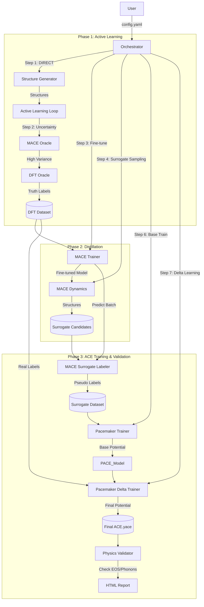

# PYACEMAKER

**Automated Machine Learning Interatomic Potential Construction System**


## Overview

**PYACEMAKER** is a next-generation pipeline designed to democratize the creation of high-accuracy Machine Learning Interatomic Potentials (MLIPs). It solves the "data efficiency" problem by leveraging **MACE Knowledge Distillation**. Instead of running thousands of expensive DFT calculations, PYACEMAKER uses a pre-trained Large Foundation Model (MACE-MP) as a "Teacher" to guide the exploration of chemical space and train a fast, production-ready "Student" potential (ACE/Pacemaker).

Ideally suited for materials scientists who need DFT-level accuracy with the speed of classical molecular dynamics.

## Key Features

-   **Scientific Validation (New)**: Rigorous physics checks including Phonon Dispersion Stability and Equation of State (EOS) verification to ensure physical correctness.
-   **Automated Reporting (New)**: Generates comprehensive HTML reports summarizing validation metrics and training performance.
-   **Master Tutorial Script (New)**: A single, executable `tutorials/UAT_AND_TUTORIAL.py` script that demonstrates the full workflow from start to finish.
-   **MACE Knowledge Distillation**: Fine-tune MACE foundation models on small DFT datasets and use them to generate massive surrogate datasets for student training.
-   **Delta Learning**: Correction of "Sim-to-Real" gap by fine-tuning the student potential on high-fidelity DFT data.
-   **Resumable Orchestration**: Robust state management allows the pipeline to recover from crashes and resume execution from the last completed step.
-   **Full 7-Step Pipeline**: Automated end-to-end workflow from Direct Sampling to Final Potential generation.
-   **Pacemaker Training**: Automated training of ACE potentials using the `Pacemaker` library.
-   **Intelligent Exploration**: DIRECT sampling (MaxMin diversity) for initial structure generation.
-   **Active Learning**: Uncertainty-based selection of structures using MACE ensemble variance.
-   **Configurable Pipeline**: Robust YAML-based configuration with schema validation (Pydantic).
-   **Mock Mode**: Fully functional mock execution for CI/CD and testing.

## Architecture Overview

The system operates as a centralized Orchestrator managing specialized modules for Generation, Oracle evaluation (MACE/DFT), Training, and Validation.


```mermaid
graph TD
    User[User] -->|config.yaml| Orch[Orchestrator]

    subgraph "Phase 1: Active Learning"
        Orch -->|Step 1: DIRECT| Gen[Structure Generator]
        Gen -->|Structures| AL[Active Learning Loop]
        AL -->|Step 2: Uncertainty| MACE_O[MACE Oracle]
        MACE_O -->|High Variance| DFT[DFT Oracle]
        DFT -->|Truth Labels| DB[(DFT Dataset)]
    end

    subgraph "Phase 2: Distillation"
        Orch -->|Step 3: Fine-tune| MACE_T[MACE Trainer]
        DB --> MACE_T
        MACE_T -->|Fine-tuned Model| MACE_MD[MACE Dynamics]
        Orch -->|Step 4: Surrogate Sampling| MACE_MD
        MACE_MD -->|Structures| S_Unlabeled[(Surrogate Candidates)]
    end

    subgraph "Phase 3: ACE Training & Validation"
        S_Unlabeled --> Label[MACE Surrogate Labeler]
        MACE_T -->|Predict Batch| Label
        Label -->|Pseudo Labels| S_DB[(Surrogate Dataset)]

        Orch -->|Step 6: Base Train| PACE_T[Pacemaker Trainer]
        S_DB --> PACE_T
        PACE_T -->|Base Potential| PACE_Model

        Orch -->|Step 7: Delta Learning| PACE_T_Delta[Pacemaker Delta Trainer]
        DB -->|Real Labels| PACE_T_Delta
        PACE_Model --> PACE_T_Delta
        PACE_T_Delta -->|Final Potential| Final_ACE[(Final ACE.yace)]

        Final_ACE --> Validator[Physics Validator]
        Validator -->|Check EOS/Phonons| Report[HTML Report]
    end
```

## Prerequisites

-   **Python 3.11+**
-   **uv** (Recommended for dependency management) or pip.
-   **MACE-MP-0** (automatically downloaded or provided via path).
-   **Pacemaker** (external binary or library).
-   **Optional**: VASP or Quantum Espresso for "Real Mode" execution.

## Installation & Setup

1.  **Clone the repository**:
    ```bash
    git clone https://github.com/your-org/pyacemaker.git
    cd pyacemaker
    ```

2.  **Install dependencies**:
    We use `uv` for fast dependency resolution.
    ```bash
    uv sync
    ```
    Or using pip:
    ```bash
    pip install .
    ```

## Usage

### Quick Start (Tutorial)

To run the master tutorial which simulates the entire pipeline (End-to-End):

```bash
# Run in Mock Mode (fast verification)
PYACEMAKER_MODE=MOCK marimo run tutorials/UAT_AND_TUTORIAL.py
```

This interactive notebook will:
1.  Generate synthetic training data (SN2 Reaction Pathway).
2.  Train a potential (Mock or Real MACE distillation).
3.  Perform physics validation (EOS, Phonons).
4.  Visualize the results and artifacts.

### Production Run

1.  **Create a configuration file** (`config.yaml`):
    ```yaml
    version: "0.1.0"
    project:
      name: "MyFirstPotential"
      root_dir: "/abs/path/to/project"
    oracle:
      # Use MACE as surrogate
      mace:
        model_path: "medium" # or path to local .model file
        device: "cuda"       # or "cpu"
      # DFT Configuration (Optional if running pure MACE or Mock)
      dft:
        code: "quantum_espresso"
        pseudopotentials:
          Fe: "Fe.pbe.UPF"
    validator:
        phonon_supercell: [2, 2, 2]
        eos_strain: 0.05
    distillation:
        enable_mace_distillation: true
    ```

2.  **Run the pipeline**:
    ```bash
    uv run pyacemaker run config.yaml
    ```

3.  **Monitor Progress**:
    The system will log its progress. Check the `data/` directory for artifacts.
    State is persisted in `pipeline_state.json`.

## Configuration Reference

A complete `config.yaml` example:

```yaml
version: "0.1.0"

project:
  name: "Fe_C_System"
  root_dir: "/home/user/projects/fe_c"

logging:
  level: "INFO"

# Oracle Settings
oracle:
  mock: false  # Set to true for testing without GPU/DFT
  mace:
    model_path: "medium"  # Downloads MACE-MP-0 medium
    device: "cuda"
    default_dtype: "float64"
    batch_size: 32
  dft:
    code: "quantum_espresso"
    command: "mpirun -np 4 pw.x"
    pseudopotentials:
      Fe: "/path/to/pseudos/Fe.pbe.UPF"
      C: "/path/to/pseudos/C.pbe.UPF"
    kspacing: 0.04
    smearing: 0.02

# Validator Settings (New)
validator:
  phonon_supercell: [3, 3, 3]
  phonon_tolerance: -0.05 # THz
  eos_strain: 0.10
  eos_points: 7

# Distillation / Trainer Settings
distillation:
  enable_mace_distillation: true
  step3_mace_finetune:
    base_model: "medium"
    epochs: 100
  step4_surrogate_sampling:
    target_points: 1000
    method: "mace_md"
  step7_pacemaker_finetune:
    enable: true
    weight_dft: 10.0

trainer:
  potential_type: "pace"
  cutoff: 5.0
  delta_learning: "zbl" # or "lj"

dynamics_engine:
  engine: "ase" # or "eon"
  temperature: 1000
  n_steps: 5000
```

## Troubleshooting

### Common Issues

1.  **`ConfigurationError: MaceManager is None but mock is False`**
    *   **Cause**: You have enabled `mace` in config but `mock: false` and the `mace` library is not installed or failed to load.
    *   **Fix**: Ensure `mace-torch` is installed (`pip install mace-torch`) or set `oracle.mock: true`.

2.  **`ValueError: Path is not within current working directory`**
    *   **Cause**: Security feature preventing write access to unauthorized directories (e.g., `/tmp`).
    *   **Fix**: Use `PYACEMAKER_SKIP_FILE_CHECKS=true` env var if you must use system temp dirs, or configure `project.root_dir` correctly.

3.  **`FileNotFoundError: Dataset file not found`**
    *   **Cause**: Cold start failed or path is incorrect.
    *   **Fix**: Ensure `project.root_dir` is absolute and exists. The Orchestrator will attempt to generate initial structures if the dataset is missing.

## Development Workflow

This project follows a strict cycle-based development process.

### Running Tests
```bash
uv run pytest
```

### Linting & Formatting
We enforce strict code quality using `ruff` and `mypy`.
```bash
uv run ruff check .
uv run mypy .
```

## Project Structure

```text
pyacemaker/
├── dev_documents/          # Specs and Architecture docs
├── src/
│   └── pyacemaker/         # Source code
│       ├── core/           # Base classes & Config
│       ├── domain_models/  # Pydantic data models & state
│       ├── oracle/         # MACE & DFT interfaces
│       ├── modules/        # Module implementations
│       ├── trainer/        # Pacemaker & MACE training
│       ├── validator/      # Physics validation & Reporting (New)
│       ├── generator/      # Structure generation
│       ├── dynamics/       # KMC & MD logic
│       ├── main.py         # CLI Entry Point
│       └── orchestrator.py # Main logic (State Machine)
├── tests/                  # Unit and Integration tests
├── tutorials/              # Executable tutorials
├── pyproject.toml          # Project configuration
└── README.md
```

## License

MIT License. See `LICENSE` for details.
