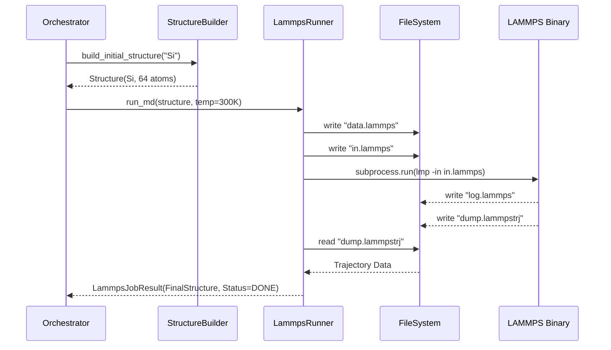

# Cycle 02: Basic Exploration (The One-Shot Pipeline)

## 1. Summary

With the foundation laid in Cycle 01, Cycle 02 moves to the first phase of the active learning loop: **Exploration**. In a mature system, this involves complex adaptive policies and uncertainty-driven halting. However, before running, we must walk. The goal of this cycle is to establish the capability to drive an external Molecular Dynamics engine (LAMMPS) from Python, execute a simulation, and parse the results back into our domain models.

We refer to this as the "One-Shot Pipeline". It is not yet a loop. It is a linear execution: Generate a structure -> Run MD -> Parse Output. This seemingly simple sequence involves significant complexity:
1.  **Input Generation**: Converting our `Structure` object into a LAMMPS data file.
2.  **Script Generation**: Writing a valid `in.lammps` script that defines interatomic potentials (initially Lennard-Jones for testing), thermodynamic ensembles (NVT/NPT), and output dumps.
3.  **Execution Management**: Launching the LAMMPS binary via `subprocess`, managing standard output/error streams, and handling timeouts or crashes.
4.  **Output Parsing**: Reading the binary or text dump files produced by LAMMPS and converting them back into a trajectory of `Structure` objects.

By the end of this cycle, we will have a `LammpsRunner` class that serves as the interface between our Python world and the HPC world. We will also implement a basic `StructureBuilder` that can generate random supercells to feed into this runner. This proves that we can "touch" the physics engine and retrieve data, a prerequisite for the more complex Oracle (Cycle 03) and Training (Cycle 04) phases.

## 2. System Architecture

In this cycle, we introduce the `physics` and `orchestration` packages. The architecture shifts from static data definitions to dynamic execution flows.

### File Structure
Files to be created/modified are in **bold**.

```ascii
mlip_autopipec/
├── src/
│   └── mlip_autopipec/
│       ├── domain_models/
│       │   ├── **job.py**              # Job status and result schemas
│       │   └── structure.py
│       ├── orchestration/
│       │   ├── **__init__.py**
│       │   └── **workflow.py**         # Linear workflow manager
│       ├── physics/
│       │   ├── **__init__.py**
│       │   ├── dynamics/
│       │   │   ├── **__init__.py**
│       │   │   └── **lammps.py**       # LAMMPS Wrapper
│       │   └── structure_gen/
│       │       ├── **__init__.py**
│       │       └── **builder.py**      # Random structure generation
│       └── **utils.py**                # Subprocess helpers
└── tests/
    └── physics/
        └── **test_lammps.py**          # Integration tests
```

### Component Interaction (The "One-Shot" Flow)

1.  **Orchestrator (`workflow.py`)**:
    -   Instantiated by the CLI.
    -   Loads `Config`.
    -   Calls `StructureBuilder` to get an initial atomic configuration (e.g., Bulk Silicon).

2.  **StructureBuilder (`builder.py`)**:
    -   Uses `ase.build` to create a perfect crystal.
    -   Applies `rattle` (random displacement) to break symmetry.
    -   Returns a `Structure` object.

3.  **LammpsRunner (`lammps.py`)**:
    -   **Input**: Receives the `Structure` and `MDParameters`.
    -   **Preparation**:
        -   Creates a temporary directory `_work_md/job_001`.
        -   Writes `data.lammps` (atomic coordinates).
        -   Writes `in.lammps` (commands).
    -   **Execution**:
        -   Calls `mpirun -np 4 lmp_serial -in in.lammps` (or similar).
        -   Captures `stdout` and `stderr`.
    -   **Parsing**:
        -   Reads `dump.lammpstrj`.
        -   Extracts the final frame.
    -   **Output**: Returns a `LammpsJobResult` containing the final `Structure` and status.

4.  **Integration with Config**:
    -   The path to the LAMMPS executable and the number of cores are defined in `config.yaml`.

### Detailed Data Flow



## 3. Design Architecture

### 3.1. Job Domain Model (`domain_models/job.py`)
We need a generic way to represent an external calculation, as we will later add DFT and Pacemaker jobs which share similar properties (status, duration, working directory).

-   **Enum `JobStatus`**:
    -   `PENDING`, `RUNNING`, `COMPLETED`, `FAILED`, `TIMEOUT`.

-   **Class `JobResult`** (Base Model):
    -   `job_id`: `str` (UUID).
    -   `status`: `JobStatus`.
    -   `work_dir`: `Path`.
    -   `duration_seconds`: `float`.
    -   `log_content`: `str` (Tail of the log).

-   **Class `LammpsResult`** (Inherits `JobResult`):
    -   `final_structure`: `Structure`.
    -   `trajectory_path`: `Path`.
    -   `max_gamma`: `Optional[float]` (Placeholder for Cycle 05).

### 3.2. LammpsRunner Logic (`physics/dynamics/lammps.py`)
This class must be robust against system differences.

-   **Class `LammpsRunner`**:
    -   `__init__(config: LammpsConfig)`: Sets executable path.
    -   `run(structure: Structure, params: MDParams) -> LammpsResult`:
        -   **Context Manager**: Use `tempfile.TemporaryDirectory` or a managed subdirectory to avoid clutter.
        -   **ASE Integration**: Use `ase.io.write(..., format='lammps-data')` for reliable conversion of the Pydantic `Structure` (via `to_ase()`) to LAMMPS format.
        -   **Template Engine**: Use simple string formatting or `jinja2` to generate `in.lammps`. We need templates for "NVT", "NPT", and "Minimisation".

### 3.3. Structure Builder (`physics/structure_gen/builder.py`)
-   **Class `StructureBuilder`**:
    -   `build_bulk(element: str, crystal_structure: str, lattice_constant: float)`: Wraps `ase.build.bulk`.
    -   `apply_rattle(structure: Structure, stdev: float)`: Adds thermal noise.
    -   `apply_strain(structure: Structure, strain_tensor: np.ndarray)`: Deforms the cell.

## 4. Implementation Approach

### Step 1: Job Models
-   Create `src/mlip_autopipec/domain_models/job.py`.
-   Define `JobStatus` and `JobResult`. This decouples the runner from the specific output format initially.

### Step 2: Structure Builder
-   Implement `physics/structure_gen/builder.py`.
-   Focus on wrapping ASE's powerful generation tools but returning our strict `Structure` model.
-   Ensure random seeds are handled deterministically (pass seed to method).

### Step 3: LAMMPS Wrapper (The Core)
-   Implement `physics/dynamics/lammps.py`.
-   **Phase 3a**: Input generation. Write a helper `_write_inputs(work_dir, structure, params)`.
-   **Phase 3b**: Execution. Use `subprocess.run` with `capture_output=True` and `text=True`. Implement a timeout mechanism.
-   **Phase 3c**: Output parsing. Use `ase.io.read(..., format='lammps-dump-text')` to parse the trajectory.

### Step 4: Orchestrator Integration
-   Implement a simple function in `orchestration/workflow.py` called `run_one_shot`.
-   It should take a `Config`, build a structure, run LAMMPS, and print the result.
-   Update `app.py` to add a `run` command that triggers this.

## 5. Test Strategy

### 5.1. Unit Testing
-   **Structure Builder**:
    -   Test `build_bulk("Si")`. Assert correct number of atoms (e.g., 2 for primitive, 8 for cubic).
    -   Test `rattle`. Assert positions have changed but cell remains same.

-   **LammpsRunner (Mocked)**:
    -   **Crucial**: We cannot assume LAMMPS is installed in the CI environment. We must mock `subprocess.run`.
    -   Create a test where `subprocess.run` is mocked to return `returncode=0` and writes a dummy `dump.lammpstrj` file to the filesystem.
    -   Verify that `LammpsRunner.run` correctly constructs the command line arguments (e.g., checking for `mpirun` if parallel is enabled).
    -   Verify that it correctly parses the dummy dump file.

### 5.2. Integration Testing (Local)
-   If LAMMPS *is* installed (checked via `shutil.which('lmp')`), run a real test.
-   Run a 10-step MD on Argon (LJ potential).
-   Assert that `final_structure` is different from `initial_structure`.
-   Assert `status` is `COMPLETED`.

### 5.3. Error Handling Tests
-   **Simulation Crash**: Mock `subprocess.run` returning `returncode=1`. Assert `LammpsRunner` returns a result with `status=FAILED`.
-   **Timeout**: Mock a timeout in subprocess. Assert `status=TIMEOUT`.
