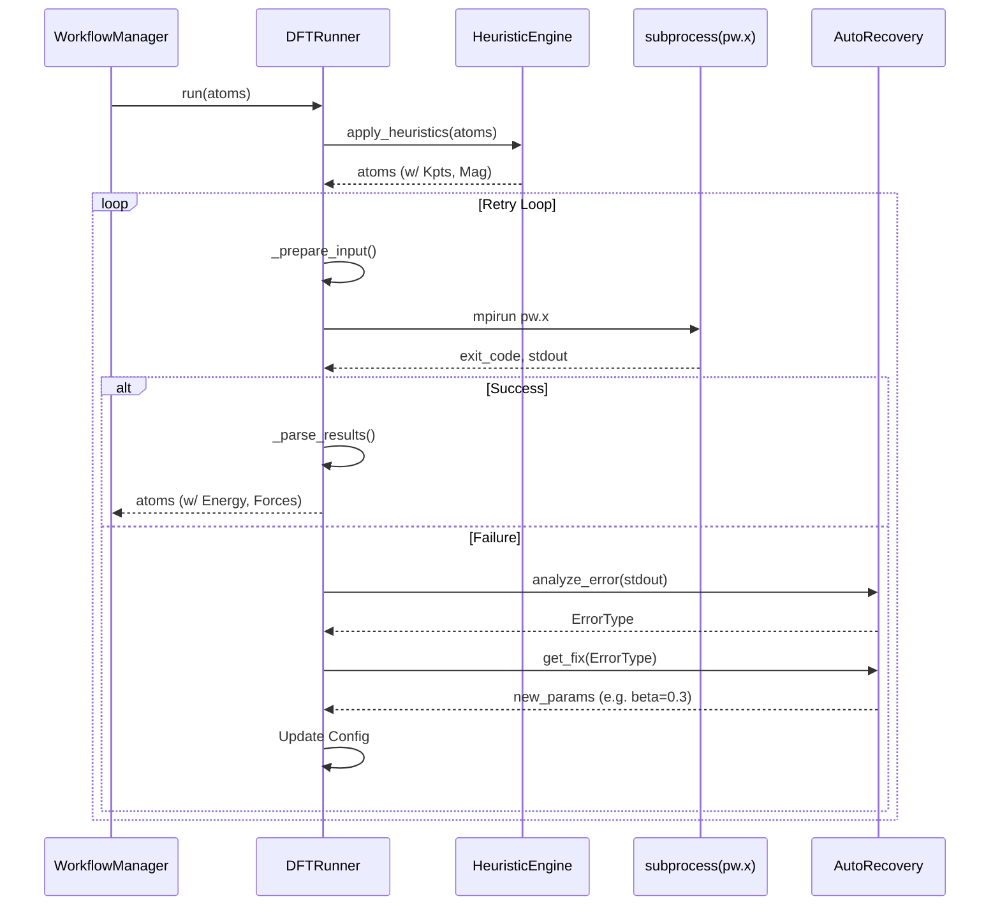

# Cycle 02: Automated DFT Factory

## 1. Summary

Cycle 02 focuses on building the **Automated DFT Factory** (Module C). This is the engine room of the MLIP-AutoPipe system. Its purpose is to perform high-fidelity quantum mechanical calculations using **Quantum Espresso (QE)** to generate the "Ground Truth" data required for training machine learning potentials.

Running DFT autonomously is notoriously difficult due to the frequent occurrence of convergence failures (e.g., charge sloshing, magnetic instabilities). A naive script that simply runs `pw.x` will fail 20-30% of the time on complex systems, halting the pipeline. Therefore, the core innovation in this cycle is not just the execution of DFT, but the **Auto-Recovery** intelligence. We implement a robust `DFTRunner` that wraps the QE executable. It monitors the calculation in real-time, parses standard output and error streams for known failure signatures, and employs a **Strategy Pattern** to dynamically adjust input parameters (e.g., reducing mixing beta, increasing electronic temperature) to rescue the job.

Additionally, this module implements a **Heuristic Engine** that removes the burden of parameter selection from the user. It automatically determines optimal K-point meshes based on lattice geometry and assigns initial magnetic moments based on elemental composition, ensuring that the calculations are physically reasonable without manual setup.

## 2. System Architecture

We expand the codebase to include the `dft` package.

```ascii
mlip_autopipec/
├── config/
│   └── models.py
├── core/
├── dft/
│   ├── __init__.py
│   ├── runner.py           # The main execution controller.
│   ├── heuristic.py        # The expert system for parameter selection.
│   └── recovery.py         # The error diagnosis and repair logic.
└── tests/
    ├── test_dft_runner.py  # Verifies command generation and execution flow.
    └── test_recovery.py    # Verifies error parsing and strategy selection.
```

### 2.1 Code Blueprints

This section details the exact class structures and method signatures.

#### 2.1.1 DFT Runner (`dft/runner.py`)

This class orchestrates the execution of a single DFT calculation. It manages the lifecycle: Prepare -> Run -> Monitor -> Recover -> Parse.

**Class `DFTRunner`**
*   **Attributes**:
    *   `config` (`DFTConfig`): Configuration parameters (command, cores, etc.).
    *   `work_dir` (`Path`): Directory where temporary files (`pw.in`, `pw.out`) are written.
    *   `recovery_manager` (`AutoRecovery`): Instance of the recovery logic handler.
*   **Methods**:
    *   `__init__(self, config: DFTConfig, work_dir: Path)`:
        *   Initializes the runner. Creates `work_dir` if it doesn't exist.
        *   Instantiates `AutoRecovery`.
    *   `run(self, atoms: Atoms) -> Atoms`:
        *   **Description**: The public entry point.
        *   **Logic**:
            1.  Call `HeuristicEngine.apply_heuristics(atoms)` to add K-points/Magnetism.
            2.  Initialize `current_params` from `config`.
            3.  Enter `while attempt < max_retries:` loop.
            4.  Call `self._prepare_input(atoms, current_params)`.
            5.  Call `self._execute()`.
            6.  If success: Call `self._parse_results()`, cleanup, and return `Atoms`.
            7.  If failure: Call `self.recovery_manager.analyze_error()`.
            8.  Get new params via `self.recovery_manager.get_fix()`.
            9.  Update `current_params` and continue loop.
            10. If retries exhausted, raise `MaxRetriesExceededError`.
    *   `_prepare_input(self, atoms: Atoms, params: Dict) -> None`:
        *   Uses `ase.io.write` to generate `pw.in`.
        *   Ensures `tprnfor=True`, `tstress=True`, `disk_io='low'`.
    *   `_execute(self) -> int`:
        *   Uses `subprocess.run` to execute `mpirun ... pw.x`.
        *   Captures `stdout` and `stderr` to files.
        *   Returns exit code.
    *   `_parse_results(self) -> Atoms`:
        *   Uses `ase.io.read("pw.out")` to get the atoms with results.
        *   Reads `pw.out` to verify "JOB DONE" string exists (double check).

#### 2.1.2 Heuristic Engine (`dft/heuristic.py`)

A static utility class that acts as the "Physics Expert".

**Class `HeuristicEngine`**
*   **Attributes**:
    *   `MAGNETIC_ELEMENTS` (`Set[str]`): `{'V', 'Cr', 'Mn', 'Fe', 'Co', 'Ni'}`.
    *   `DEFAULT_K_DENSITY` (`float`): `0.15` (1/A).
*   **Methods**:
    *   `apply_heuristics(cls, atoms: Atoms) -> Atoms`:
        *   Wrapper that calls `get_kpoints` and `get_magnetic_moments` and updates the atoms object in-place (attaching `kpts` and `magmoms` to `atoms.info` or `atoms.calc` parameters).
    *   `get_kpoints(cls, atoms: Atoms, density: float) -> Tuple[int, int, int]`:
        *   Logic: $N_i = \max(1, \text{round}(b_i / density))$ where $b_i$ is reciprocal lattice vector length.
    *   `get_magnetic_moments(cls, atoms: Atoms) -> Optional[List[float]]`:
        *   Checks if any atom symbol is in `MAGNETIC_ELEMENTS`.
        *   If yes, returns a list where magnetic elements get `5.0` (ferromagnetic init) and others get `0.0`.
        *   If no, returns `None` (non-spin-polarized calculation).
    *   `get_pseudopotentials(cls, elements: List[str]) -> Dict[str, str]`:
        *   Loads from a bundled `sssp_precision.json` file.
        *   Returns mapping `{'Fe': 'Fe.pbe-n-kjpaw_psl.1.0.0.UPF', ...}`.

#### 2.1.3 Auto Recovery (`dft/recovery.py`)

A stateful error handler.

**Class `AutoRecovery`**
*   **Attributes**:
    *   `history` (`List[RecoveryAction]`): Tracks what fixes have been tried.
*   **Methods**:
    *   `analyze_error(self, stdout: str, stderr: str) -> ErrorType`:
        *   Scans logs for Regex patterns.
        *   **Patterns**:
            *   `"convergence NOT achieved"` -> `ErrorType.CONVERGENCE`
            *   `"Error in routine c_bands"` -> `ErrorType.DIAGONALIZATION`
            *   `"Cholesky"` -> `ErrorType.CHOLESKY`
    *   `get_fix(self, error: ErrorType) -> Dict[str, Any]`:
        *   **Logic**:
            *   If `CONVERGENCE`:
                *   Attempt 1: Reduce `mixing_beta` (0.7 -> 0.3).
                *   Attempt 2: Change `mixing_mode` to `local-tf`.
                *   Attempt 3: Increase `degauss` (temperature).
            *   If `DIAGONALIZATION`:
                *   Switch to `diagonalization='cg'`.
        *   updates `self.history`.
        *   Returns a dictionary of parameters to merge into the next config (e.g., `{'mixing_beta': 0.3}`).

#### 2.1.4 Data Flow Diagram (Cycle 02)



## 3. Design Architecture

### 3.1 Facade Pattern for DFT

We use the **Facade Pattern** to hide the complexity of Quantum Espresso behind the `DFTRunner` interface.
*   **Why**: The rest of the system (Workflow Manager) should not care about `pw.in` file formatting, K-point grids, or MPI flags. It just wants to call `run(atoms)` and get results.
*   **Benefit**: If we later decide to support VASP or CASTEP, we just implement a `VaspRunner` with the same interface, without changing the workflow logic.

### 3.2 Strategy Pattern for Recovery

The `AutoRecovery` module uses a simplified **Strategy Pattern**.
*   **Why**: Error recovery is complex and heuristic. Hardcoding a giant `if/else` block is unmaintainable.
*   **Implementation**: Each `ErrorType` maps to a list of strategies (Fixes). The `get_fix` method iterates through the available strategies for that error type.
*   **Statefulness**: The recovery manager must be stateful (via `history`). A common bug in automated DFT is "Oscillation": Fix A is applied, fails. Fix B is applied, fails. The system tries Fix A again. We must prevent this by checking history.

### 3.3 Heuristics as "Defaults"

We adopt the design philosophy that **"Explicit is better than Implicit, but Good Defaults are better than Manual Setup"**.
*   The `HeuristicEngine` provides the defaults.
*   However, the `SystemConfig` overrides these. If the user *explicitly* sets `dft_kpoints_density` in `input.yaml`, the heuristic engine uses that value instead of its hardcoded default. This provides flexibility for power users while keeping it simple for novices.

## 4. Implementation Approach

1.  **Mocking Infrastructure**:
    *   Create `tests/mocks/mock_qe.py`. This script will act as `pw.x`. It reads `pw.in`. If it finds a special comment `# FAIL_ONCE`, it prints a convergence error and exits with code 1. If it finds `# FAIL_TWICE`, it decrements a counter file and fails until counter is 0. This is essential for testing recovery without burning CPU hours on real DFT.

2.  **Heuristic Implementation**:
    *   Implement `heuristic.py`. Include the SSSP JSON file in the package data.
    *   Test with `test_heuristic.py` to verify K-point scaling.

3.  **Recovery Implementation**:
    *   Implement `recovery.py`. Use a dictionary to map `ErrorType` to lists of fix dictionaries.
    *   Test with `test_recovery.py` using sample stdout log files (saved from real crashed runs).

4.  **Runner Implementation**:
    *   Implement `runner.py`.
    *   Connect the pieces: Heuristics -> Write -> Run -> Check -> Recover -> Read.
    *   Use `ase.io.read` carefully. Note that `ase.io.read` might fail if the output is truncated. Wrap it in try/except.

## 5. Test Strategy

### 5.1 Unit Testing

*   **`tests/test_heuristic.py`**:
    *   **K-points**: Pass a $10\times10\times10$ $\text{\AA}$ cell. Assert K-points are roughly $4\times4\times4$. Pass a $2\times2\times2$ $\text{\AA}$ cell. Assert K-points are roughly $20\times20\times20$.
    *   **Magnetism**: Pass "Fe". Assert `magmoms` are set. Pass "Si". Assert `magmoms` are None.

*   **`tests/test_recovery.py`**:
    *   **Diagnosis**: Feed the string "... convergence NOT achieved ..." to the parser. Assert it detects `ErrorType.CONVERGENCE`.
    *   **Prescription**: Assert that the `ConvergenceHandler` reduces `mixing_beta` from 0.7 to 0.3.

### 5.2 Integration Testing (with Mock)

*   **The "Third Time's the Charm" Test**:
    *   **Setup**: Configure `DFTConfig` to point `dft_command` to `python tests/mocks/mock_qe.py`.
    *   **Scenario**: The mock fails twice (Error A, then Error B) and succeeds on the third attempt.
    *   **Action**: `DFTRunner.run(atoms)`.
    *   **Verify**:
        *   `subprocess.run` was called 3 times.
        *   Call 1 args: default.
        *   Call 2 args: `mixing_beta` changed.
        *   Call 3 args: `mixing_beta` AND `diagonalization` changed.
        *   Final result is Success.
        *   Runner did not raise exception.
