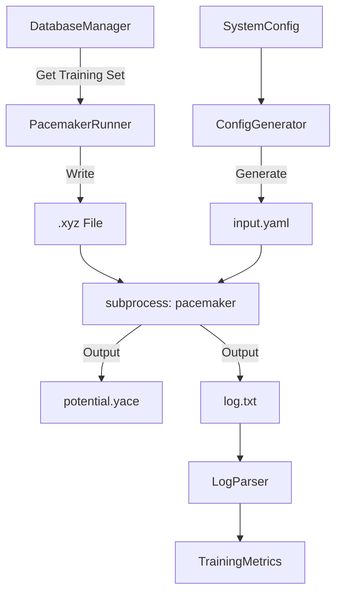

# Cycle 05: Active Learning Integration

## 1. Summary

Cycle 05 implements **Module D: Active Learning & Training**. At this stage, we have high-quality Ground Truth data (from Cycle 02) stored in our database. Now, we need to distill this data into a fast Machine Learning Potential (MLP). We utilize **Pacemaker**, a powerful tool for training Atomic Cluster Expansion (ACE) potentials.

This cycle is not just about running a training script. It involves:
1.  **Data Preparation**: Converting our ASE database into the specific formats required by Pacemaker (pandas pickles or extended XYZ).
2.  **Delta Learning**: Configuring the training to learn the *difference* between the DFT energy and a baseline repulsion (ZBL) potential. This is crucial for robustness in high-energy collision regimes (e.g., radiation damage or high-T MD).
3.  **Metrics Parsing**: Automatically extracting validation metrics (RMSE, MAE) from the logs to decide if the potential is "good enough" or needs another round of data generation.

## 2. System Architecture

We add the `learning` package.

```ascii
mlip_autopipec/
├── config/
├── core/
├── learning/
│   ├── __init__.py
│   ├── pacemaker.py        # The runner.
│   ├── config_gen.py       # The YAML generator.
│   └── metrics.py          # The log parser.
└── tests/
    └── test_learning.py    # Tests config generation and parsing.
```

### 2.1 Code Blueprints

This section details the training automation.

#### 2.1.1 Config Generator (`learning/config_gen.py`)

Pacemaker requires a complex `input.yaml`. We generate this programmatically.

**Class `PacemakerConfigGenerator`**
*   **Methods**:
    *   `__init__(self, config: SystemConfig)`
    *   `generate(self, dataset_path: Path) -> dict`:
        *   **Description**: Constructs the configuration dictionary.
        *   **Structure**:
            *   `cutoff`: `self.config.training.cutoff` (default 5.0).
            *   `data`: `{'filename': str(dataset_path)}`.
            *   `potential`:
                *   `delta_spline_bins`: 100
                *   `elements`: `self.config.elements`
                *   `embeddings`: ...
                *   `bonds`: ...
            *   `fit`:
                *   `loss`: `kappa` (RMSE loss).
                *   `weighting`: `{'energy': 1.0, 'forces': 100.0}`.
            *   `backend`:
                *   `evaluator`: `tensor_potential` (GPU acceleration).
    *   `_get_zbl_params(self) -> dict`:
        *   Calculates ZBL repulsion parameters (inner cutoff, outer cutoff) based on atomic numbers Z1, Z2.
        *   Ensures strong repulsion at $r < 1.5$ Å.

#### 2.1.2 Pacemaker Runner (`learning/pacemaker.py`)

Manages the training process.

**Class `PacemakerRunner`**
*   **Attributes**:
    *   `config_generator` (`PacemakerConfigGenerator`)
    *   `work_dir` (`Path`)
*   **Methods**:
    *   `train(self, dataset: List[Atoms]) -> Path`:
        *   **Logic**:
            1.  Write `dataset` to `train.xyz` (extxyz format) in `work_dir`.
            2.  Generate config dict via `config_generator`.
            3.  Write `input.yaml`.
            4.  Call `subprocess.run(["pacemaker", "input.yaml"])`.
            5.  Wait for completion.
            6.  Verify `output_potential.yace` exists.
            7.  Return path to `.yace` file.

#### 2.1.3 Metrics Parser (`learning/metrics.py`)

Parses the `metrics.txt` or log file.

**Class `LogParser`**
*   **Methods**:
    *   `parse(self, log_path: Path) -> TrainingMetrics`:
        *   Reads file content.
        *   Uses Regex to find:
            *   `RMSE_E_train`, `RMSE_F_train`
            *   `RMSE_E_test`, `RMSE_F_test`
        *   Returns a Pydantic object `TrainingMetrics`.

**Class `TrainingMetrics(BaseModel)`**
*   **Fields**:
    *   `rmse_energy` (`float`)
    *   `rmse_forces` (`float`)
    *   `is_converged` (`bool`):
        *   Logic: `rmse_forces < 0.05` eV/A (configurable).

#### 2.1.4 Data Flow Diagram (Cycle 05)



## 3. Design Architecture

### 3.1 Delta Learning Strategy

We adopt **Delta Learning** as a core architectural choice.
*   **Concept**: $E_{total} = E_{ZBL}(r) + E_{ML}(r)$.
*   **Why**: Machine Learning models are interpolators. They behave unpredictably outside their training data. In High-T MD or radiation damage simulations, atoms come very close together (high energy). If the ML model hasn't seen this, it might predict attractive forces, causing fusion (collapse).
*   **Implementation**: A ZBL (Ziegler-Biersack-Littmark) potential provides the correct $1/r^{12}$ Coulomb repulsion at short range. The ML model learns the *correction* to this. This ensures physical safety.

### 3.2 Configuration Abstraction

Pacemaker's config file is verbose and sensitive to syntax.
*   **Abstraction**: We do not let the user write `pacemaker` configs directly. We generate them from the `SystemConfig`.
*   **Benefit**: We can enforce best practices (e.g., ensuring `loss_weights` prioritize forces over energy 100:1). We can also automatically adjust basis set sizes (`max_degree`) based on the amount of data available (preventing overfitting on small datasets).

### 3.3 Metric-Driven Decisions

The `metrics.py` module turns the log file into actionable data.
*   **Convergence**: The `is_converged` flag will be used by the `WorkflowManager` in Cycle 06 to decide whether to stop the loop.
*   **History**: We verify that RMSE is decreasing over cycles. If RMSE increases, it indicates "Catastrophic Forgetting", and the system might need to increase the weight of old data.

## 4. Implementation Approach

1.  **Metric Parsing (TDD)**:
    *   Get a sample `log.txt` from a real Pacemaker run (or create a realistic dummy).
    *   Write `test_learning.py` to regex-match the RMSE values.
    *   Implement `LogParser`.

2.  **Config Generation**:
    *   Implement `PacemakerConfigGenerator`.
    *   Verify the ZBL parameter logic (it depends on atomic numbers Z).

3.  **Runner Implementation**:
    *   Implement `PacemakerRunner`.
    *   **Mocking**: Create a `mock_pacemaker` script that just writes a file `output_potential.yace` and prints "RMSE_F_test: 0.03" to stdout. This allows testing the pipeline without installing the heavy tensor-flow/torch backend of Pacemaker.

## 5. Test Strategy

### 5.1 Unit Testing

*   **Config Generation**:
    *   Input: `SystemConfig(elements=['Fe', 'C'], cutoff=4.5)`.
    *   Output: Verify the YAML string contains `cutoff: 4.5` and `elements: [Fe, C]`. Verify ZBL parameters for Fe and C are correct.

*   **Log Parsing**:
    *   Input: A string block mimicking a Pacemaker log file.
    *   Action: Parse.
    *   Assert: `rmse_forces == 0.023` (matching the log).

### 5.2 Integration Testing

*   **Mock Training Run**:
    *   Export 10 atoms from DB.
    *   Generate Config.
    *   Run Mock Pacemaker.
    *   Parse Results.
    *   Verify `potential.yace` "exists" (in the temp folder).
