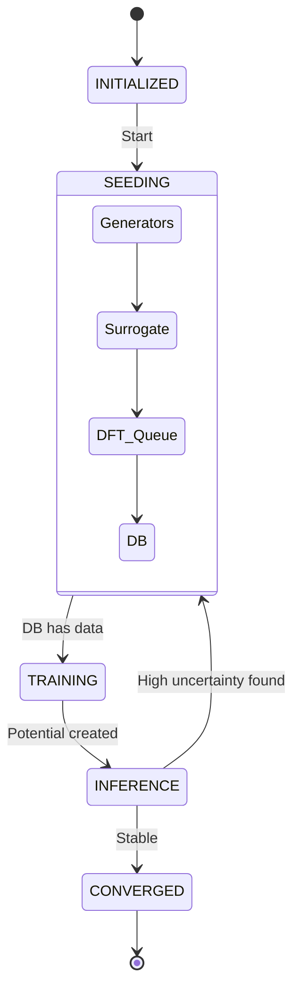

# Cycle 06: Workflow Orchestration

## 1. Summary

Cycle 06 is where the separate modules become a "System". We implement **Module: Workflow Orchestration**.

Until now, we have built tools: a hammer (DFT), a saw (Generator), and a drill (Trainer). The **Workflow Manager** is the carpenter. It orchestrates the sequence of operations, deciding when to generate data, when to calculate, and when to train.

Crucially, this module introduces **Scalability** via Dask. Instead of running loops sequentially (Structure 1 -> DFT -> Structure 2...), the manager submits thousands of tasks to a Dask cluster (which could be a local multicore machine or a SLURM cluster). It also introduces **Robustness** via Checkpointing. If the power goes out after 3 days of calculation, the system must not restart from zero. It saves its state (iteration count, job status) to disk and resumes seamlessly.

## 2. System Architecture

We add the `workflow` package.

```ascii
mlip_autopipec/
├── config/
├── core/
├── workflow/
│   ├── __init__.py
│   ├── manager.py          # The brain.
│   ├── scheduler.py        # The hands (Dask).
│   └── state.py            # The memory (Checkpoint).
└── tests/
    └── test_workflow.py    # Verifies state transitions.
```

### 2.1 Code Blueprints

This section details the state machine and parallel processing logic.

#### 2.1.1 Workflow State (`workflow/state.py`)

This Pydantic model persists the runtime state.

**Class `WorkflowPhase(Enum)`**
*   Values: `INITIALIZED`, `SEEDING`, `TRAINING`, `INFERENCE`, `CONVERGED`.

**Class `WorkflowState(BaseModel)`**
*   **Fields**:
    *   `iteration` (`int`): Current active learning cycle index (0 to N).
    *   `phase` (`WorkflowPhase`): Current step.
    *   `pending_job_ids` (`List[str]`): List of Dask Future keys currently running.
    *   `best_potential_path` (`Optional[Path]`): Path to the latest validated `.yace`.
*   **Methods**:
    *   `save(self, path: Path)`: Serializes to JSON.
    *   `load(cls, path: Path) -> WorkflowState`: Factory method.

#### 2.1.2 Task Scheduler (`workflow/scheduler.py`)

Abstracts the Dask Distributed client.

**Class `TaskScheduler`**
*   **Attributes**:
    *   `client` (`dask.distributed.Client`): The connection to the cluster.
*   **Methods**:
    *   `__init__(self, config: SystemConfig)`:
        *   If `config.scheduler_address` is set, connect to it.
        *   Else, start `LocalCluster(n_workers=config.parallel_cores)`.
    *   `submit(self, func: Callable, *args, **kwargs) -> Future`:
        *   Wraps `client.submit`.
        *   Handles pickling errors gracefully.
    *   `shutdown(self)`: Closes the client.

#### 2.1.3 Workflow Manager (`workflow/manager.py`)

The main event loop.

**Class `WorkflowManager`**
*   **Attributes**:
    *   `config` (`SystemConfig`)
    *   `state` (`WorkflowState`)
    *   `scheduler` (`TaskScheduler`)
    *   `db` (`DatabaseManager`)
    *   `dft_runner` (`DFTRunner`)
*   **Methods**:
    *   `run(self)`:
        *   **Logic**:
            1.  Load state or initialize.
            2.  `while state.phase != CONVERGED`:
                *   `if phase == SEEDING`: `self._run_seeding()`
                *   `if phase == TRAINING`: `self._run_training()`
                *   `if phase == INFERENCE`: `self._run_inference()`
            3.  Log "Workflow Completed".
    *   `_run_seeding(self)`:
        *   Call `GeneratorFactory` to get 1000 structures.
        *   Call `Surrogate` to filter.
        *   Submit DFT jobs via `scheduler.submit(dft_runner.run, atom)`.
        *   Wait for results (`as_completed`).
        *   Add results to DB.
        *   Transition to `TRAINING`.
    *   `_run_training(self)`:
        *   Call `PacemakerRunner.train()`.
        *   Update `state.best_potential_path`.
        *   Transition to `INFERENCE`.

#### 2.1.4 Data Flow Diagram (Cycle 06)



## 3. Design Architecture

### 3.1 State Machine Persistence

The `WorkflowManager` is designed as a **State Machine**.
*   **Atomic Transitions**: The state is only updated *after* a phase completes successfully and is checkpointed.
*   **Resumability**: If the process is killed (SIGKILL), re-running the command loads `state.json`. If `phase == SEEDING`, it checks the DB to see how many jobs finished and resumes submitting the rest.

### 3.2 Parallelism Strategy

We use **Dask** for parallelism.
*   **Why Dask?**: It handles complex dependency graphs (though we mostly use "Bag" or simple futures) and scales from laptop to SLURM easily.
*   **Job Granularity**: A single DFT job is one task. This is "fine-grained" enough to load-balance well, but "coarse-grained" enough that python overhead is negligible (minutes of compute vs milliseconds of dispatch).

### 3.3 Separation of Concerns

The Manager does *not* know how to run DFT. It only knows it has a `dft_runner` object with a `run()` method.
*   **Dependency Injection**: The runners are injected into the manager. This makes testing easy (inject a MockRunner).

## 4. Implementation Approach

1.  **State Logic**: Implement `WorkflowState`. Test serialization to/from JSON.
2.  **Dask Wrapper**: Implement `Scheduler`. Ensure we can submit a simple `sleep` function and get a result.
3.  **The Loop**: Implement the `run()` method in `WorkflowManager`. This is a complex function. We will use a state-machine approach (`while not converged: match state...`).
4.  **Checkpointing**: Insert `state.save()` calls after every major batch submission and after training.

## 5. Test Strategy

### 5.1 Unit Testing

*   **State Serialization**:
    *   Create state object. Populate with dummy jobs.
    *   Save to JSON.
    *   Load back. Assert equality.

### 5.2 Integration Testing (The Mock Pipeline)

*   **Scenario**: Run 2 iterations of the loop.
*   **Setup**:
    *   Mock Generator (returns 2 atoms).
    *   Mock DFT (returns Energy=0.0).
    *   Mock Trainer (returns 'potential_v1.yace').
*   **Execution**:
    *   Start Manager.
    *   Assert it transitions Iteration 0 -> 1 -> 2.
    *   Assert `database.count()` increases.
    *   **Crash Test**: Kill the manager in Iteration 1. Restart. Assert it resumes at Iteration 1, not 0.
