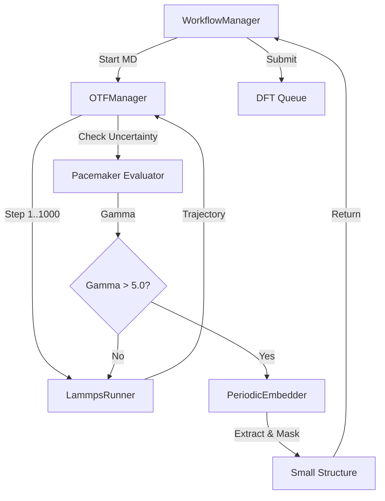

# Cycle 07: Scalable Inference & OTF

## 1. Summary

Cycle 07 closes the loop. We implement **Module E: Scalable Inference & OTF**.

The purpose of training a potential is to use it. Here, we implement the **Inference Engine** using **LAMMPS**. We run large-scale Molecular Dynamics (MD) simulations. However, in an Active Learning context, we don't just "run" MD; we **monitor** it.

We implement **On-The-Fly (OTF) Uncertainty Quantification**. The system watches the simulation. If the atomic configuration enters a region of phase space where the potential is unsure (extrapolation grade $\gamma$ is high), the simulation is paused.

The core innovation here is **Periodic Embedding**. We cannot simply cut out a cluster of atoms and send it to DFT, because the vacuum surface would create massive forces that don't exist in the bulk. Instead, we extract the local environment into a small, periodic supercell. We then apply **Force Masking**: when we train on this new cell, we tell the machine learning code to *ignore* the forces on the atoms near the boundary (the buffer region), because they are artificially perturbed by the new periodicity. We only learn from the "core" atoms which see a true bulk-like environment.

## 2. System Architecture

We add the `inference` package.

```ascii
mlip_autopipec/
├── config/
├── core/
├── inference/
│   ├── __init__.py
│   ├── lammps_runner.py    # The engine.
│   ├── embedding.py        # The surgical tool.
│   └── otf_loop.py         # The controller.
└── tests/
    ├── test_lammps.py      # Validates input generation.
    └── test_embedding.py   # Validates geometric extraction.
```

### 2.1 Code Blueprints

This section details the geometry and simulation logic.

#### 2.1.1 Periodic Embedder (`inference/embedding.py`)

This class handles the surgical extraction of local environments.

**Class `PeriodicEmbedder`**
*   **Methods**:
    *   `extract_region(self, large_atoms: Atoms, center_idx: int, radius: float, buffer: float) -> Atoms`:
        *   **Input**: A large supercell, an atom index to center on, a core radius ($r_c$), and a buffer width ($\delta$).
        *   **Logic**:
            1.  Define cubic cell size $L = 2(r_c + \delta)$.
            2.  Create new `Atoms` object with cell $L \times L \times L$.
            3.  Iterate over all atoms $j$ in `large_atoms`.
            4.  Compute distance $d_{ij}$ using MIC.
            5.  If $d_{ij} < (r_c + \delta)$, add atom $j$ to new cell.
            6.  Shift positions so `center_idx` is at $(L/2, L/2, L/2)$.
            7.  **Masking**:
                *   Create array `mask` of length $N_{new}$.
                *   If $d_{ij} < r_c$, `mask[k] = 1.0` (Core).
                *   Else `mask[k] = 0.0` (Buffer).
            8.  Store `mask` in `atoms.arrays['force_mask']`.
            9.  Return small `atoms`.

#### 2.1.2 LAMMPS Runner (`inference/lammps_runner.py`)

Runs the MD simulation.

**Class `LammpsRunner`**
*   **Methods**:
    *   `run_md(self, atoms: Atoms, potential_path: Path, steps: int, temp: float) -> List[Atoms]`:
        *   **Logic**:
            1.  Generate `data.lmp` from atoms.
            2.  Generate `input.lmp` with:
                *   `pair_style pace`
                *   `pair_coeff * * {potential_path} {elements}`
                *   `compute 1 all extrapolation/grade ...` (if supported) or just dump forces.
                *   `dump 1 all custom 100 dump.lammpstrj ...`
            3.  Execute `lmp_serial < input.lmp`.
            4.  Parse `dump.lammpstrj` using `ase.io.read`.
            5.  Return trajectory list.

#### 2.1.3 OTF Manager (`inference/otf_loop.py`)

Controls the active learning feedback.

**Class `OTFManager`**
*   **Methods**:
    *   `run_and_monitor(self, start_structure: Atoms, potential: Path) -> List[Atoms]`:
        *   **Logic**:
            1.  Break simulation into blocks (e.g., 10 blocks of 1000 steps).
            2.  For `block` in `blocks`:
                *   Run `LammpsRunner` for `block`.
                *   Load trajectory.
                *   Calculate Max Extrapolation Grade $\gamma_{max}$ for the last frame.
                *   **Pacemaker Check**: Use `pacemaker.calculate_state(atoms, potential)` to get $\gamma$.
                *   If $\gamma_{max} > \text{threshold}$ (e.g. 5.0):
                    *   Log "Uncertainty detected".
                    *   Select atom with max $\gamma$.
                    *   Call `PeriodicEmbedder.extract_region`.
                    *   Return `[new_structure]`.
            3.  If loop finishes without trigger, return `[]`.

#### 2.1.4 Data Flow Diagram (Cycle 07)



## 3. Design Architecture

### 3.1 Force Masking Principle

This is the physics-informed part of the cycle.
*   **Problem**: Cutting a cluster creates surface atoms. These atoms have dangling bonds. DFT will calculate forces trying to heal these bonds (huge forces).
*   **Consequence**: If we train the MLIP on these forces, it learns that "bulk atoms should suddenly rearrange", which is wrong.
*   **Solution**: We define a "Buffer Zone". We tell the MLIP: "Use the positions of these buffer atoms to describe the environment of the core atoms, but **do not learn** the forces on the buffer atoms themselves."
*   **Implementation**: This relies on the ASE database storing `force_mask` and Pacemaker respecting it during training.

### 3.2 Decoupled Inference

The inference (MD) runs independently of the training.
*   **Async**: We can run 100 MD simulations in parallel.
*   **Throughput**: Even if 1 simulation finds a bad spot and stops, the others continue. This maximizes the exploration of phase space.

## 4. Implementation Approach

1.  **Embedding Logic**: This is pure geometry. Implement using ASE. Pay close attention to Periodic Boundary Conditions (using `ase.geometry.get_distances`).
2.  **LAMMPS Integration**: Implement `LammpsRunner`. Use `ase.io.lammps` to write data files.
3.  **Masking**: Ensure the `force_mask` is correctly stored in `info` or `arrays` so the `DatabaseManager` picks it up.

## 5. Test Strategy

### 5.1 Unit Testing

*   **Embedding**:
    *   Create a 1D chain of atoms: 0, 1, 2, ... 100.
    *   Extract around atom 50 with radius 2.
    *   Assert we get atoms 48, 49, 50, 51, 52.
    *   Assert atoms 48 and 52 have mask 0 (buffer). Atom 50 has mask 1.

### 5.2 Integration Testing

*   **The "Bad Spot" Test**:
    *   Mock an MD trajectory that has 1 frame with a very weird bond length.
    *   Run `OTFManager`.
    *   Assert it flags that frame.
    *   Run `PeriodicEmbedder` on that frame.
    *   Assert the resulting structure is small and contains the weird bond.
