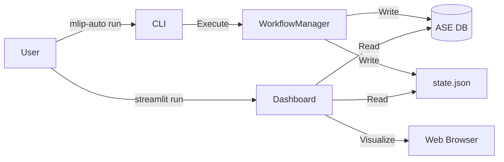

# Cycle 08: User Interface & Final Polish

## 1. Summary

Cycle 08 is the final integration phase. We have built a sophisticated engine; now we need to put a steering wheel on it.

We implement the **Command Line Interface (CLI)**. A complex system like this must be easy to start. We follow the principle of "Convention over Configuration". The user should only need to type `mlip-auto init` to get a sensible default config, and `mlip-auto run` to start the science.

We also add a **Dashboard**. While the CLI is good for control, a GUI is better for monitoring. We build a lightweight **Streamlit** app that connects to the database and visualizes the Learning Curve (RMSE vs Time) and renders 3D views of the structures being added.

Finally, we perform the **End-to-End (E2E) Tests**. We run the full pipeline from scratch on a reference problem to certify that MLIP-AutoPipe is ready for release.

## 2. System Architecture

We add the `cli` and `dashboard` packages.

```ascii
mlip_autopipec/
├── cli/
│   ├── __init__.py
│   └── main.py             # Typer app.
├── dashboard/
│   ├── app.py              # Streamlit script.
│   └── plots.py            # Plotting logic.
└── README.md               # Final docs.
```

### 2.1 Code Blueprints

This section details the user entry points.

#### 2.1.1 CLI Application (`cli/main.py`)

Built with `typer`.

**Function `app`**
*   **Commands**:
    *   `init(name: str = "my_project")`:
        *   Creates directory `name`.
        *   Writes `input.yaml` template with comments explaining fields.
    *   `run(config: Path = "input.yaml", dry_run: bool = False)`:
        *   Loads `MinimalConfig`.
        *   Instantiates `WorkflowManager`.
        *   Calls `manager.run()`.
        *   Handles `KeyboardInterrupt`: calls `manager.save_state()`.
    *   `status(project_dir: Path)`:
        *   Loads `WorkflowState` from `state.json`.
        *   Connects to DB.
        *   Prints rich-text table (using `rich.console`) summarizing:
            *   Iteration
            *   Phase
            *   Structures in DB
            *   Best RMSE

#### 2.1.2 Dashboard (`dashboard/app.py`)

A standalone script run via `streamlit run ...`.

**Layout**:
1.  **Sidebar**: Select Project Directory.
2.  **Header**: Project Status (Phase, Iteration).
3.  **Tab 1: Learning Curves**:
    *   Plotly line chart: `metric_history` from DB (RMSE Energy/Force vs Iteration).
4.  **Tab 2: Structure Browser**:
    *   Slider: Select Structure ID.
    *   3D View: `stmol` rendering of the atom.
    *   Table: Energy, Max Force, Uncertainty.
5.  **Tab 3: Logs**:
    *   Tail of `system.log`.

#### 2.1.3 Data Flow Diagram (Cycle 08)



## 3. Design Architecture

### 3.1 Usability First

The CLI is the face of the product.
*   **Helpful Errors**: We wrap the main execution in a global exception handler. If it crashes, we print a helpful message ("Check logs at ...") instead of just a stack trace.
*   **Rich Output**: We use the `rich` library to print colorful progress bars and status tables. This assures the user that the system is alive during long DFT runs.

### 3.2 Decoupled Dashboard

The Dashboard is a *viewer*. It does not modify state.
*   **Safety**: Even if the dashboard crashes or hangs, the main workflow (which might be running on a different node) is unaffected.
*   **Real-time**: Since SQLite supports concurrent reads, the dashboard can refresh while the workflow is writing new data.

## 4. Implementation Approach

1.  **CLI**: Write `main.py`. Ensure it handles `KeyboardInterrupt` gracefully (saving state before exit).
2.  **Dashboard**: Write `app.py`. It should accept the DB path as a command-line arg.
3.  **Documentation**: Write a comprehensive `README.md` explaining installation, usage, and architecture.
4.  **Final Polish**: Run the linter one last time. Fix any docstrings.

## 5. Test Strategy

### 5.1 Unit Testing

*   **CLI**:
    *   Test `mlip-auto init`. Assert file created.
    *   Test `mlip-auto run` with bad config. Assert error message.

### 5.2 End-to-End Testing (The Grand Finale)

*   **Protocol**:
    *   Environment: Fresh Virtual Env.
    *   Input: `input.yaml` targeting "Aluminium".
    *   Mode: `DRY_RUN=True` (using internal mocks for physics).
    *   Action: `mlip-auto run input.yaml`.
    *   Verification:
        *   Process exits with code 0.
        *   `results/potential.yace` exists.
        *   `mlip.db` has entries.
        *   Dashboard opens (manual check).

This concludes the development of MLIP-AutoPipe.
