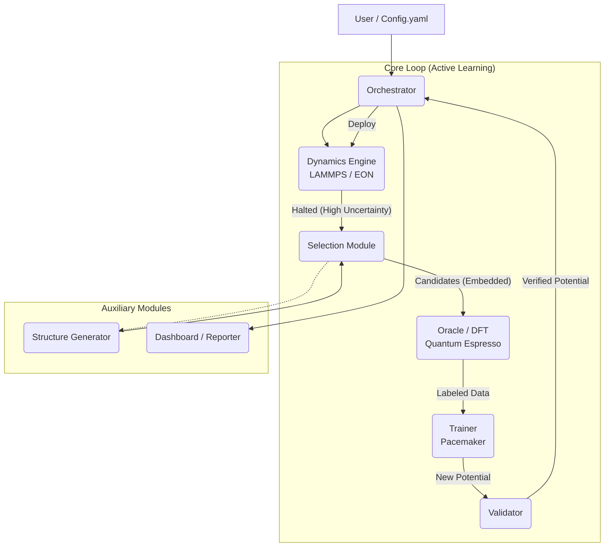

# System Architecture: PyAcemaker

## 1. Summary

**PyAcemaker** is an automated Machine Learning Interatomic Potential (MLIP) construction system designed to democratize high-accuracy atomistic simulations. Built upon the **Pacemaker** (Atomic Cluster Expansion) engine, it eliminates the need for deep expertise in data science and computational physics, allowing materials scientists to generate "State-of-the-Art" potentials with a single configuration file ("Zero-Config").

The system employs a robust **Active Learning** workflow that autonomously explores chemical space, detects regions of high uncertainty, and selectively performs First-Principles (DFT) calculations. By integrating **Hybrid Potentials** (ACE + ZBL/LJ baselines) and **Physics-Informed Validation** (Phonons, Elasticity), PyAcemaker ensures that the generated potentials are not only accurate but also physically safe and stable for large-scale Molecular Dynamics (MD) and Kinetic Monte Carlo (kMC) simulations.

## 2. System Design Objectives

1.  **Zero-Config Automation**:
    *   Minimize user intervention. A single YAML file drives the entire pipeline from initial structure generation to final potential deployment.
    *   No custom Python scripting required for standard workflows.

2.  **Data Efficiency (Active Learning)**:
    *   Reduce DFT computational costs by >90% compared to random sampling.
    *   Utilize **D-Optimality** (Active Set selection) to select only the most informative structures for training.
    *   Implement **Periodic Embedding** to accurately calculate forces for local defects without surface artifacts.

3.  **Physics-Informed Robustness**:
    *   **Safety First**: Prevent non-physical behaviors (e.g., core collapse) by enforcing a Hybrid Potential strategy (ACE + ZBL/LJ).
    *   **Self-Healing**: Automatically recover from DFT convergence failures (SCF errors) and simulation crashes (MD halts).

4.  **Scalability & Extensibility**:
    *   Modular architecture allowing independent scaling of DFT (Oracle) and MD (Dynamics) workloads.
    *   Support for advanced sampling methods (kMC, Defect engineering) beyond simple MD.

## 3. System Architecture

The system follows a modular **Hub-and-Spoke** architecture, with the **Orchestrator** acting as the central brain that coordinates specialized autonomous agents.



### Component Description

1.  **Orchestrator**: The state machine managing the workflow lifecycle. It handles transitions between phases (Exploration, Calculation, Training) and manages the file system structure.
2.  **Dynamics Engine (Exploration)**: Runs MD (LAMMPS) or kMC (EON) simulations. It includes a "Watchdog" that monitors the extrapolation grade ($\gamma$) and halts execution when uncertainty exceeds a threshold.
3.  **Selection Module**: The "Brain" of active learning. It extracts halted structures, generates local candidates (via normal modes or random displacement), and selects the most informative subset using D-Optimality. It also performs **Periodic Embedding** to prepare structures for DFT.
4.  **Oracle (DFT)**: The ground truth provider. It executes DFT calculations (Quantum Espresso) with robust error handling (self-correction for mixing beta, smearing, etc.).
5.  **Trainer**: Wraps the Pacemaker engine. It manages the dataset, enforces physical baselines (Delta Learning), and fine-tunes the potential.
6.  **Validator**: A quality gate that checks physical properties (Phonon stability, Elastic constants, EOS) before allowing a potential to be deployed.
7.  **Structure Generator**: Provides initial structures and specialized samples (defects, strains) based on an adaptive policy.

## 4. Design Architecture

The codebase utilizes **Pydantic** for strict schema validation and **Interface-based** design for modularity.

### File Structure

```ascii
src/mlip_autopipec/
├── main.py                     # Entry point (CLI)
├── config/                     # Configuration Schemas
│   ├── models.py               # Pydantic Models (Config, State)
│   └── defaults.py             # Default parameter sets
├── orchestration/              # Workflow Management
│   ├── coordinator.py          # Main Loop Logic
│   └── state_manager.py        # Resume/Checkpoint handling
├── phases/                     # Implementation of Workflow Phases
│   ├── dft/                    # Oracle Module
│   │   ├── runner.py           # QE execution wrapper
│   │   └── error_handler.py    # Self-healing logic
│   ├── training/               # Trainer Module
│   │   ├── pacemaker.py        # Pacemaker CLI wrapper
│   │   └── dataset.py          # Data management
│   ├── dynamics/               # Dynamics Module
│   │   ├── lammps_driver.py    # LAMMPS Python interface
│   │   └── watchdog.py         # Uncertainty monitoring
│   ├── selection/              # Selection Module
│   │   ├── active_set.py       # D-Optimality logic
│   │   └── embedding.py        # Periodic Embedding logic
│   └── validation/             # Validator Module
│       ├── phonons.py          # Phonopy interface
│       └── elasticity.py       # Elastic tensor calculation
└── generator/                  # Structure Generator
    ├── defects.py              # Defect generation
    └── policy.py               # Adaptive exploration policy
```

### Key Data Models

*   **`WorkflowState`**: Tracks the current iteration, active potential path, and accumulated dataset statistics.
*   **`CandidateStructure`**: Represents an atomic structure selected for calculation, carrying metadata (origin, uncertainty score, embedding status).
*   **`DFTResult`**: Contains energy, forces, and stress tensors from the Oracle, along with convergence status.
*   **`ValidationReport`**: Aggregates pass/fail metrics from phonon and elastic tests.

## 5. Implementation Plan

The development is divided into **8 Sequential Cycles**.

*   **CYCLE01: Skeleton & Configuration**
    *   Establish project structure, CLI entry point, and logging.
    *   Implement Pydantic configuration schemas (`WorkflowConfig`).
    *   Set up the main loop structure (State Machine stub).

*   **CYCLE02: Oracle (DFT Engine)**
    *   Implement `QERunner` for Quantum Espresso.
    *   Implement `RecoveryHandler` for DFT error correction (SCF convergence).
    *   Create `DFTPhase` interface.

*   **CYCLE03: Trainer (Pacemaker Interface)**
    *   Implement `PacemakerWrapper` for `pace_train` and dataset tools.
    *   Implement `DatasetManager` for handling `.pckl.gzip` files.
    *   Implement Delta Learning (ZBL/LJ) configuration generation.

*   **CYCLE04: Dynamics (LAMMPS Engine)**
    *   Implement `LammpsRunner` using Python interface.
    *   Implement `HybridPairStyle` generator (PACE + ZBL).
    *   Implement `UncertaintyWatchdog` (fix halt) logic.

*   **CYCLE05: Selection (Active Learning Logic)**
    *   Implement `CandidateProcessor` to extract halted frames.
    *   Implement `PeriodicEmbedding` to create valid DFT supercells from clusters.
    *   Implement `ActiveSetSelector` (MaxVol/D-Optimality) to filter redundant structures.

*   **CYCLE06: Validation Suite**
    *   Implement `PhononValidator` (Phonopy integration).
    *   Implement `ElasticityValidator` (Born criteria).
    *   Implement `EOSValidator` (Birch-Murnaghan).

*   **CYCLE07: Advanced Exploration**
    *   Implement `StructureGenerator` for defects (vacancies, interstitials).
    *   Implement `EONWrapper` for kMC support.
    *   Implement Adaptive Policy logic for sampling.

*   **CYCLE08: Integration & Dashboard**
    *   Integrate all phases into the `Orchestrator` main loop.
    *   Implement `DashboardGenerator` (HTML reporting).
    *   Finalize End-to-End tests and User Acceptance Testing.

## 6. Test Strategy

### Unit Testing
*   Each module (`phases/dft`, `phases/training`, etc.) will have dedicated `pytest` suites.
*   **Mocking**: External binaries (pw.x, lmp, pace_train) will be mocked using `subprocess` wrappers or Python mocks to ensure tests run fast and without heavy dependencies.

### Integration Testing
*   **Phase Integration**: Test the data hand-off between pairs of modules (e.g., Dynamics -> Selection, Selection -> Oracle).
*   **State Persistence**: Verify that the workflow can be paused and resumed correctly using `WorkflowState`.

### System Testing (End-to-End)
*   **Simulation Mode**: A "dry-run" mode where DFT and Training are simulated with dummy data to verify the logic flow of the Active Learning cycle.
*   **Reference Run**: A small-scale real run (e.g., Aluminum or Silicon) to verify physical correctness on a single node.

### User Acceptance Testing (UAT)
*   Jupyter Notebooks will be provided for each cycle to demonstrate usage.
*   Scenarios will cover "Happy Path" (smooth convergence) and "Edge Cases" (DFT failure, MD explosion recovery).
