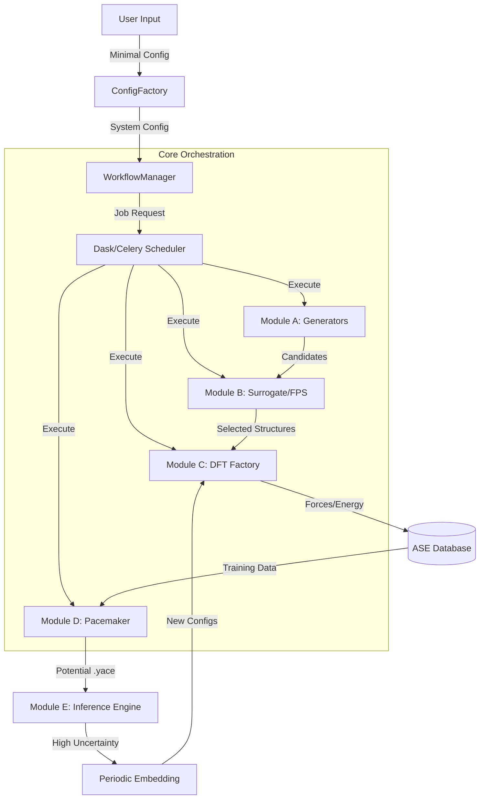

# System Architecture: MLIP-AutoPipe

## 1. Summary

The **MLIP-AutoPipe** (Machine Learning Interatomic Potential Automated Pipeline) is a pioneering "Zero-Human" protocol designed to autonomously generate, train, and validate machine learning potentials (MLIPs) for materials science. This system addresses one of the most persistent bottlenecks in computational materials science: the "Chicken and Egg" problem of dataset generation.

In traditional workflows, developing a high-fidelity MLIP requires a diverse and representative dataset of atomic structures and their corresponding forces and energies, typically calculated via Density Functional Theory (DFT). To explore the configuration space effectively and generate physically relevant structures (e.g., liquids, high-temperature polymorphs, diffusion pathways), one ideally needs to run Ab Initio Molecular Dynamics (AIMD). However, AIMD is computationally prohibitively expensive for exploring large phase spaces and long timescales. Alternatively, one could use a cheaper classical potential to drive the sampling, but if a reliable potential already existed, the project would be unnecessary. Thus, researchers often find themselves in a bind: they need a potential to generate data to train the potential.

MLIP-AutoPipe resolves this paradox by implementing a fully closed-loop, autonomous active learning system. Instead of relying on manual dataset curation or expensive brute-force AIMD, the system leverages a **Surrogate-First** strategy. It employs pre-trained foundation models (such as MACE-MP) to "scout" the vast chemical space. These surrogate models, having been trained on massive public databases (like the Materials Project), provide a reasonable "zeroth-order" approximation of the potential energy surface. This allows the system to generate and screen millions of candidate structures—ranging from distorted lattices to random alloys—at negligible cost, selecting only the most information-rich configurations (via Farthest Point Sampling) for accurate but expensive DFT validation.

Once the initial "seed" potential is trained, the system enters a **Decoupled Inference & Training** loop. Here, the roles of "Explorer" (Molecular Dynamics simulation) and "Teacher" (DFT calculations) are architecturally separated. The inference engine runs massively parallel simulations to push the material into unknown regions of the phase space. Crucially, it is equipped with uncertainty quantification metrics. When the simulation encounters a configuration where the potential's prediction is unreliable (high extrapolation grade), the system does not crash or hallucinate physics. Instead, it pauses, excises the problematic local environment using a novel **Periodic Embedding** technique, and dispatches it to the **Automated DFT Factory**.

This Factory is built for resilience. It wraps the Quantum Espresso engine with robust auto-recovery logic capable of diagnosing and fixing convergence failures without human intervention. The resulting ground-truth data is fed back into the training loop, updating the potential on-the-fly. This cycle continues until the potential is robust enough to handle the target simulation goals—such as melt-quench processes or defect migration—with DFT-level accuracy but at MD speeds.

Ultimately, MLIP-AutoPipe democratizes access to high-performance atomistic modeling. It allows a user—potentially a non-expert in electronic structure theory—to simply define a material system (e.g., "FeNi Alloy") and a physical objective (e.g., "Calculate Melting Point"), and have the system autonomously deliver a robust, validated MLIP and the requested physical properties, transforming what used to be a PhD-sized project into a streamlined, automated workflow.

## 2. System Design Objectives

### 2.1 Goals

The primary goal of MLIP-AutoPipe is to achieve **Zero-Human Intervention**. This means the pipeline must be self-driving from the moment the user provides the initial configuration to the delivery of the final report. There should be no need for a human to manually restart a crashed DFT job, tweak electronic mixing parameters, adjust time-steps, or filter training data. The system must possess enough encoded intelligence to handle these routine operational deviations.

Secondly, the system aims for **Resource Efficiency**. Computational time on supercomputers is a scarce resource. Traditional random sampling or uniform grid searches waste millions of CPU hours on redundant configurations that add little value to the machine learning model. By integrating **Active Learning** and **Surrogate Screening**, MLIP-AutoPipe aims to reduce the number of required DFT calculations by an order of magnitude compared to brute-force methods, achieving a target RMSE (e.g., < 5 meV/atom) with the minimal necessary training set.

Thirdly, **Physical Accuracy and Robustness** are non-negotiable. An automated system that produces unphysical results is worse than useless. The architecture explicitly incorporates physics-informed generators (for elasticity, phonons, and defects) to ensuring the potential is grounded in physical reality, not just numerical fitting. The use of **Periodic Embedding with Force Masking** specifically addresses the artifacts introduced when cutting clusters from bulk systems, ensuring that the training data accurately reflects the bulk electronic environment.

### 2.2 Constraints

*   **Software Stack**: The system must be implemented in **Python 3.10+**, leveraging modern language features for type safety and asynchronous execution.
*   **Dependency Management**: We strictly use **`uv`** for fast, reliable package management, ensuring reproducible environments.
*   **External Engines**: The system acts as a orchestrator for established scientific codes: **Quantum Espresso** for DFT, **LAMMPS** for MD, **Pacemaker** for ACE potential training, and **MACE** as the surrogate model. The architecture must handle the installation paths and execution environments of these binaries flexibly.
*   **Code Quality**: The codebase must adhere to strict **`ruff`** linting and **`mypy`** static type checking in strict mode. This is critical for preventing runtime errors in long-running autonomous jobs where debugging is difficult.
*   **Data Provenance**: Every number produced by the system must be traceable. We must use an ASE-based database (SQLite/PostgreSQL) to store not just the atomic structures, but rich metadata including the exact code version, calculation parameters, and parentage of every structure.

### 2.3 Success Criteria

1.  **Autonomous Completion**: The pipeline must successfully complete a "Melt-Quench" workflow for a binary alloy system (e.g., Fe-Ni) without any uncaught exceptions or manual restarts.
2.  **Convergence**: The Active Learning loop must demonstrate convergence, defined as the stabilization of the Root Mean Square Error (RMSE) on a hold-out test set and the decrease in the frequency of high-uncertainty events during MD.
3.  **Physical Validation**: The generated potential must reproduce key physical quantities—specifically the Lattice Constant, Bulk Modulus, and Melting Point—within 5% of the values predicted by full DFT or experimental literature.
4.  **Resilience**: The system must demonstrate the ability to recover from at least 90% of standard SCF convergence failures in Quantum Espresso using its heuristic auto-recovery strategies.

## 3. System Architecture

The system is architected as a modular, event-driven pipeline, orchestrated by a central state machine. It follows a "Hub-and-Spoke" model where the **Workflow Manager** (Hub) coordinates the activities of specialized modules (Spokes).

### 3.1 Components

1.  **Configuration Factory**: This component parses the user's high-level intent (Minimal Config) and expands it into a fully deterministic System Configuration. It validates inputs against physical constraints (e.g., compositions summing to 100%) and hardware resources.
2.  **Module A: Physics-Informed Generator**: This is the "imagination" of the system. It generates the initial hypothesis space. It contains specialized algorithms to create Disordered Alloys (SQS), Strained Lattices (for elasticity), and Vibrating Molecules (Normal Mode Sampling).
3.  **Module B: Surrogate Explorer**: This is the "filter". It uses a fast, pre-trained neural network (MACE) to evaluate the thousands of ideas generated by Module A. It discards physically impossible structures and uses Farthest Point Sampling (FPS) to select only the most distinct and diverse candidates for further study.
4.  **Module C: Automated DFT Factory**: This is the "ground truth" engine. It executes Quantum Espresso calculations. Crucially, it includes an **Auto-Recovery** layer that parses error logs (stdout/stderr) and dynamically adjusts calculation parameters (mixing beta, diagonalization algorithm, temperature) to rescue failing jobs.
5.  **Module D: Active Learner**: This is the "brain". It uses the verified data from Module C to train the specialized Machine Learning Potential (ACE) using Pacemaker. It handles the "Delta Learning" formalism, training the model to predict the difference between DFT and a cheap baseline physics model (ZBL).
6.  **Module E: Inference & OTF Engine**: This is the "prover". It runs the actual physical simulations (MD) using the trained potential. It monitors the "Extrapolation Grade" (uncertainty) of the simulation in real-time. When the simulation wanders into unknown territory, this module freezes the frame, extracts the local environment via Periodic Embedding, and sends it back to Module C, closing the active learning loop.

### 3.2 Data Flow & Interactions

The data flows cyclically through these components.



The **ASE Database** acts as the persistent memory of the system. All modules read from and write to this central repository, ensuring that if the workflow crashes, it can be resumed exactly where it left off without data loss.

## 4. Design Architecture

### 4.1 File Structure and Philosophy

The codebase is organized to enforce separation of concerns. The root package `mlip_autopipec` contains distinct sub-packages for each logical module.

```ascii
mlip_autopipec/
├── config/                 # Configuration Management
│   ├── __init__.py
│   └── models.py           # Pydantic models for SystemConfig, DFTConfig, etc.
├── core/                   # Core Infrastructure
│   ├── __init__.py
│   ├── database.py         # ASE-db wrapper
│   └── logging.py          # Centralized logging
├── generators/             # Module A: Structure Generation
│   ├── __init__.py
│   ├── alloy.py            # SQS and Lattice Strain
│   └── molecule.py         # Normal Mode Sampling
├── surrogate/              # Module B: Surrogate & Selection
│   ├── __init__.py
│   ├── mace_client.py      # Interface to MACE-MP
│   └── fps_selector.py     # Farthest Point Sampling logic
├── dft/                    # Module C: DFT Factory
│   ├── __init__.py
│   ├── runner.py           # Quantum Espresso Runner
│   ├── recovery.py         # Error parsing and recovery
│   └── heuristic.py        # K-points, SSSP selection
├── learning/               # Module D: Active Learning
│   ├── __init__.py
│   ├── pacemaker.py        # Pacemaker wrapper
│   └── metrics.py          # Uncertainty quantification
├── inference/              # Module E: Inference & OTF
│   ├── __init__.py
│   ├── lammps_runner.py    # LAMMPS wrapper
│   └── embedding.py        # Periodic Embedding & Force Masking
├── workflow/               # Orchestration
│   ├── __init__.py
│   └── manager.py          # State machine & Dask client
└── cli/                    # User Interface
    ├── __init__.py
    └── main.py             # Entry point
```

### 4.2 Class Design and Data Models

We adopt a **Schema-First** design philosophy. All configuration objects and inter-module data packets are defined as **Pydantic** models. This ensures strictly typed interfaces and validation at the boundaries.

*   **`SystemConfig`**: The monolithic configuration object that is passed down to all factories. It is immutable during runtime.
*   **`WorkflowState`**: A mutable model that tracks the progress (e.g., `iteration_count`, `current_phase`). This is serialized to JSON for checkpointing.
*   **Factory Pattern**: We extensively use Factories (e.g., `GeneratorFactory`, `DFTRunnerFactory`) to instantiate specific implementations based on the string configurations provided by the user. This allows for easy extensibility (e.g., adding VASP support later alongside Quantum Espresso).
*   **Strategy Pattern**: Used for algorithms that might change based on context. For example, the `AutoRecovery` system uses a Strategy pattern to select the appropriate fix (Mixer adjustment vs Temperature adjustment) based on the specific error regex matched in the logs.

## 5. Implementation Plan

The development is broken down into 8 distinct cycles, each delivering a validatable increment of the system.

*   **CYCLE01: Core Framework & Configuration**
    *   **Goal**: Establish the "skeleton" of the application.
    *   **Features**: Project structure setup, Pydantic configuration models, ASE Database wrapper, and centralized logging.
    *   **Outcome**: The ability to parse a user YAML and initialize an empty database.

*   **CYCLE02: Automated DFT Factory (Module C)**
    *   **Goal**: Build the engine that produces ground truth.
    *   **Features**: `DFTRunner` for Quantum Espresso, Heuristic parameter generation (K-points, Magnetism), and the critical Auto-Recovery logic.
    *   **Outcome**: A module that can take an atomic structure and reliably return Energy/Forces, retrying automatically if QE crashes.

*   **CYCLE03: Physics-Informed Generator (Module A)**
    *   **Goal**: Build the source of candidate structures.
    *   **Features**: Algorithms for SQS generation, Lattice Strain application, and Defect (Vacancy/Interstitial) creation.
    *   **Outcome**: The ability to generate thousands of diverse, physically valid atomic structures.

*   **CYCLE04: Surrogate Explorer (Module B)**
    *   **Goal**: Implement the filter to save compute cost.
    *   **Features**: MACE-MP inference client for fast pre-screening, and Farthest Point Sampling (FPS) for diversity selection.
    *   **Outcome**: A pipeline that takes thousands of candidates and returns the "best" subset for DFT.

*   **CYCLE05: Active Learning Integration (Module D)**
    *   **Goal**: Enable the system to learn.
    *   **Features**: Wrapper for Pacemaker training, Delta Learning implementation, and metric extraction (RMSE).
    *   **Outcome**: The ability to train a `.yace` potential file from the data in the ASE database.

*   **CYCLE06: Workflow Orchestration**
    *   **Goal**: Connect the components.
    *   **Features**: The `WorkflowManager` state machine, Dask integration for parallel execution, and Checkpointing/Resumption logic.
    *   **Outcome**: A running loop that connects Generation -> Surrogate -> DFT -> Training.

*   **CYCLE07: Scalable Inference & OTF (Module E)**
    *   **Goal**: Close the loop with active feedback.
    *   **Features**: LAMMPS execution wrapper, OTF Uncertainty detection, and the Periodic Embedding/Force Masking logic.
    *   **Outcome**: The full "Active Learning" cycle where MD failures trigger new DFT calculations.

*   **CYCLE08: User Interface & Final Polish**
    *   **Goal**: Make it usable.
    *   **Features**: CLI (`mlip-auto run`), a Streamlit Dashboard for monitoring, and End-to-End integration tests.
    *   **Outcome**: A polished, documented, and distributable software package.

## 6. Test Strategy

Testing is paramount for a "Zero-Human" system. We employ a multi-layered testing strategy.

### 6.1 Unit Testing
Every individual class (Generators, Parsers, Config Models) will be tested in isolation.
*   **Mocking**: We will aggressively mock external binaries (`pw.x`, `lmp_serial`, `pacemaker`). We do not want unit tests to actually run heavy physics calculations. Instead, we mock the `subprocess.run` calls to verify that the *correct commands* are issued and that the *output parsers* correctly handle various mock stdout strings (including failure cases).
*   **Property Testing**: For mathematical components like generators, we check invariants (e.g., "straining a lattice by 5% increases volume by approx 15%", "SQS composition matches target").

### 6.2 Integration Testing
These tests verify the hand-offs between modules.
*   **Database Integration**: Verify that `DFTRunner` output is correctly serialized into the `DatabaseManager` and can be retrieved by the `PacemakerRunner` with all metadata intact.
*   **Recovery Integration**: Verify that the `DFTRunner` correctly invokes `AutoRecovery` when it sees a failure, and that the modified parameters are actually used in the subsequent retry attempt.

### 6.3 End-to-End (E2E) Testing
*   **Dry Run**: We will implement a "Dry Run" mode where all external physics codes are replaced by fast Python surrogates (e.g., returning random forces or Lennard-Jones energies). This allows us to run the *entire* 8-step pipeline in minutes on a CI server to verify the orchestration logic.
*   **Reference Run**: On a capable machine, we will run a small real-world example (e.g., Aluminum Melt-Quench) to verify physical correctness.

### 6.4 User Acceptance Testing (UAT)
*   **Notebooks**: Each cycle will be accompanied by a Jupyter Notebook that acts as a tutorial and a proof-of-concept. This allows the user (and the developer) to interactively verify the functionality of the new modules in a friendly environment.
