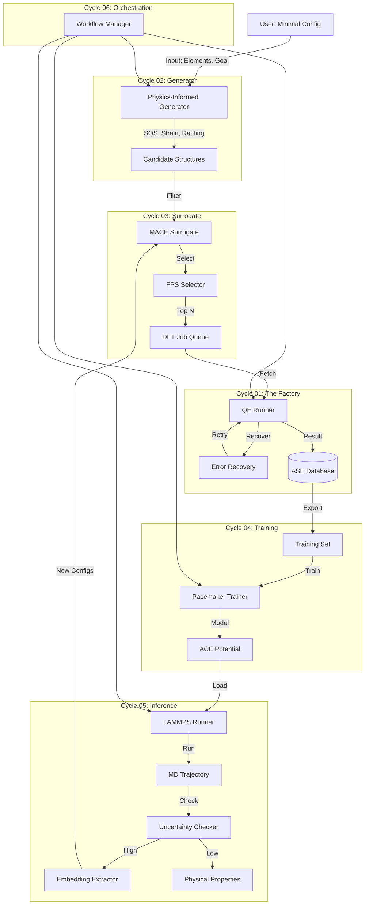

# System Architecture: MLIP-AutoPipe

## 1. Summary

The **MLIP-AutoPipe (Machine Learning Interatomic Potential Automatic Pipeline)** represents a paradigm shift in computational materials science. Traditional methods for simulating atomic dynamics suffer from a fundamental dichotomy: First-Principles methods (like Density Functional Theory, DFT) are accurate but computationally prohibitive for large systems ($O(N^3)$ scaling), while empirical potentials (like Embedded Atom Method, EAM) are fast ($O(N)$) but lack predictive accuracy for complex chemistries. Machine Learning Interatomic Potentials (MLIPs) offer the "Holy Grail"—DFT accuracy at empirical potential speeds—but their creation remains a laborious, artisanal process requiring deep expertise in both physics and data science.

This project addresses the **"Chicken and Egg" problem** inherent in MLIP generation: to generate a robust potential, one needs a diverse dataset covering the relevant phase space; however, to explore that phase space (e.g., via Molecular Dynamics) to collect data, one needs a reasonably accurate potential. Current workflows rely heavily on human intuition to break this cycle—manually selecting structures, tweaking DFT parameters, and iteratively refining models. This manual intervention is the primary bottleneck preventing high-throughput materials discovery.

**MLIP-AutoPipe** solves this by implementing a **"Zero-Human" Protocol**. The system is designed to be an autonomous agent that takes a minimal user input (e.g., "Aluminum-Copper alloy for melt-quench applications") and orchestrates the entire lifecycle of potential generation. It begins by procedurally generating a diverse initial dataset using physics-informed heuristics (SQS, strain, rattling), thereby bypassing the need for an initial potential. It then enters a closed-loop active learning cycle where it trains a model, uses it to run simulations, identifies atomic configurations where the model is uncertain, and automatically launches high-fidelity DFT calculations to label these configurations.

The system integrates best-in-class components into a seamless pipeline: **Quantum Espresso** for ground-truth DFT calculations, **MACE-MP** (a pre-trained foundation model) for rapid surrogate pre-screening, **Pacemaker** for training production-grade Atomic Cluster Expansion (ACE) potentials, and **LAMMPS** for large-scale molecular dynamics. Uniquely, the system employs a **Periodic Embedding Strategy**, which allows it to extract small, periodic training samples from massive non-periodic simulations, ensuring that the local chemical environments are preserved without introducing artificial surface effects. This allows the model to learn from "bulk-like" environments even when the simulation involves complex phenomena like crack propagation or melting. By automating the entire feedback loop—including error recovery for failed DFT jobs and dynamic hyperparameter optimization—MLIP-AutoPipe democratizes access to high-accuracy simulations, enabling researchers to focus on the *science* of materials rather than the *mechanics* of simulation.

## 2. System Design Objectives

The architectural decisions for MLIP-AutoPipe are driven by four core design objectives, each essential for achieving the vision of a fully autonomous materials discovery engine.

### 2.1. Zero-Human Automation (The "Set and Forget" Principle)
The primary objective is the total elimination of manual intervention during the active learning loop. In current workflows, a human expert typically spends weeks monitoring jobs: checking for DFT convergence failures, deciding which structures to add to the training set, and verifying if the potential is stable. MLIP-AutoPipe must automate all these decisions.
-   **Autonomy**: The system must be able to recover from common failures (e.g., DFT SCF non-convergence) by automatically adjusting numerical parameters (mixing beta, diagonalization algorithms) without human input.
-   **Decision Making**: It must algorithmically decide when to stop exploring and start training, based on quantitative metrics (e.g., Extrapolation Grade $\gamma$) rather than gut feeling.
-   **Robustness**: The pipeline must be resilient to "bad" data. If a generated structure causes a segmentation fault in the DFT code, the system must catch the error, log it, quarantine the structure, and proceed with the rest of the batch, rather than crashing the entire workflow.

### 2.2. Computational Efficiency (The Surrogate-First Strategy)
Ab initio calculations are expensive. A single self-consistent field (SCF) calculation for a 100-atom supercell can take hours on a modern compute node. Therefore, the system is designed to treat DFT as a scarce resource to be spent frugally.
-   **Surrogate Pre-screening**: Before committing a structure to the expensive DFT queue, the system utilizes a fast, pre-trained "Surrogate" model (MACE-MP) to evaluate its plausibility. Structures that are physically nonsensical (e.g., overlapping atoms) are rejected instantly at zero cost.
-   **Information Maximization**: We utilize Farthest Point Sampling (FPS) on structural descriptors to ensure that we only compute DFT for structures that are significantly different from what is already in our database. This prevents the "redudancy trap" where the model is trained on thousands of nearly identical snapshots.
-   **Delta Learning**: By training the MLIP to learn the difference between the DFT energy and a baseline physics model (ZBL/Morse), we reduce the complexity of the function the neural network needs to approximate, leading to faster convergence with fewer data points.

### 2.3. Physical Accuracy & Fidelity
Automation must not compromise physical rigor. A common failure mode in automated MLIP generation is the "Hole in the Potential," where the model predicts non-physical forces in rare configurations (e.g., high-energy collisions), leading to unphysical fusion of atoms.
-   **Physics-Informed Priors**: The dataset generation module explicitly creates high-energy "rattled" structures and highly compressed lattices to teach the model about the repulsive core of the interatomic potential.
-   **Periodic Embedding**: When extracting a local environment from a large MD simulation (e.g., a liquid region inside a solid), simple cluster extraction introduces vacuum surfaces that confuse the model. Our "Periodic Embedding" strategy wraps the local environment in a new periodic box with a buffer zone, ensuring the atoms "see" a bulk-like environment.
-   **Force Masking**: To correct for the artificial forces introduced at the boundary of the embedded box, we implement a masking scheme where the loss function only considers forces on the central atoms, ignoring the buffer region.

### 2.4. Scalability & Modularity
The system is built to scale from a single workstation (for testing) to large HPC clusters (for production).
-   **Asynchronous Execution**: The architecture decouples "Producers" (Generators, MD Engines) from "Consumers" (DFT Factory, Trainers). They communicate via persistent queues (Database), allowing the MD simulation to continue running while the DFT engine processes a backlog of training data.
-   **Modular Interfaces**: The code defines strict interfaces for each component (e.g., `MDRunner`, `DFTEngine`). This allows specific implementations to be swapped easily—for example, replacing Quantum Espresso with VASP, or Pacemaker with NequIP—without rewriting the orchestration logic.

## 3. System Architecture

### 3.1. High-Level Data Flow and Component Interaction

The system architecture is best understood as a cyclical data processing pipeline that continuously refines a central artifact: the **Interatomic Potential**. The cycle is driven by the flow of atomic structures (configurations) and their associated labels (energies, forces, stresses).



The workflow begins in **Cycle 02 (Generator)**, where the system overcomes the "Cold Start" problem. Since we have no potential to run MD, we use heuristics (SQS for alloys, NMS for molecules) to generate a "Seed Dataset".

This seed data flows into **Cycle 03 (Surrogate)**. Here, the system acts as a gatekeeper. It uses a pre-trained `MACE-MP` model to discard unphysical structures and applies `Farthest Point Sampling` to select only the most distinct configurations. This ensures that our expensive DFT resources are not wasted on redundant data.

The selected candidates move to **Cycle 01 (The Factory)**. This is the heavy-lifting module. The `QERunner` executes Quantum Espresso calculations. It is wrapped in a robust error-handling layer (`AutoRecovery`) that can diagnose and fix common SCF convergence issues, ensuring high throughput. The results (Energy, Forces, Stress) are stored in the centralized `ASE Database`.

Once enough data accumulates, **Cycle 04 (Training)** is triggered. The `Pacemaker` module pulls data from the DB, applies `Delta Learning` (subtracting a ZBL baseline), and trains a new ACE potential. The training process includes automatic validation set splitting to monitor overfitting.

The trained potential is deployed to **Cycle 05 (Inference)**. Here, `LAMMPS` runs large-scale simulations (e.g., melting, diffusion). Crucially, the simulation is monitored by an `Uncertainty Checker`. If the model encounters a configuration where its prediction confidence (Extrapolation Grade) drops below a threshold, the simulation pauses. The `Embedding Extractor` cuts out the problematic local environment, wraps it in a periodic box, and sends it back to the Surrogate/DFT queue. This closes the Active Learning Loop.

Finally, **Cycle 06 (Orchestration)** manages this entire state machine, handling concurrency, job scheduling, and user reporting via a Dashboard.

## 4. Design Architecture

The software design follows a **Schema-First** approach using **Pydantic**. This ensures that all data flowing between modules is strictly validated, preventing "silent failures" where bad data propagates through the pipeline. The codebase is organized into a flat, modular package structure.

### 4.1. File Structure

```
mlip_autopipec/
├── app.py                      # Entry point (CLI)
├── core/                       # Core infrastructure
│   ├── config.py               # Pydantic configuration models (The "Source of Truth")
│   ├── database.py             # Database abstraction layer (ASE DB wrapper)
│   └── logging.py              # Centralized logging with Rich
├── generator/                  # Module A: Structure Generation
│   ├── structure_builder.py    # Main generator orchestrator
│   ├── sqs.py                  # Interface to icet for SQS generation
│   ├── strain.py               # Logic for applying lattice deformations
│   └── modifiers.py            # Rattling and defect injection logic
├── surrogate/                  # Module B: Surrogate Explorer
│   ├── mace_client.py          # Interface to MACE-MP foundation model
│   └── fps_selector.py         # Farthest Point Sampling implementation
├── dft/                        # Module C: DFT Factory
│   ├── qe_runner.py            # Quantum Espresso execution wrapper
│   └── recovery.py             # Heuristic rules for DFT error recovery
├── training/                   # Module D: Active Learning
│   ├── pacemaker_wrapper.py    # Interface to Pacemaker training code
│   ├── dataset_prep.py         # Delta learning & Force masking preparation
│   └── physics.py              # ZBL baseline and analytical physics
├── inference/                  # Module E: Inference Engine
│   ├── lammps_runner.py        # LAMMPS execution wrapper
│   ├── uq.py                   # Uncertainty quantification logic
│   └── embedding.py            # Periodic embedding & cluster extraction geometry
└── orchestration/              # Cycle 06: Workflow Management
    ├── workflow_manager.py     # State machine for the active learning loop
    ├── task_queue.py           # Dask/Distributed task management
    └── dashboard.py            # Plotly-based reporting dashboard
```

### 4.2. Key Data Models and Invariants

1.  **`SimulationConfig` (core/config.py)**: The root configuration object.
    -   *Invariant*: `target_system` must specify elements that exist in the periodic table.
    -   *Invariant*: `composition` fractions must sum to 1.0.

2.  **`DFTResult` (core/models.py)**: The standardized output from the DFT factory.
    -   *Field*: `atoms` (ase.Atoms) - The final geometry.
    -   *Field*: `energy` (float) - The total energy in eV.
    -   *Field*: `forces` (Nx3 array) - The Hellmann-Feynman forces.
    -   *Invariant*: `forces` array shape must match `atoms` length.

3.  **`TrainingBatch` (training/models.py)**: A collection of structures ready for Pacemaker.
    -   *Field*: `structures` (List[Atoms])
    -   *Field*: `force_masks` (List[Array]) - Weights for each atom (0 or 1).
    -   *Invariant*: Any atom in the buffer zone of an embedded cluster must have `weight=0`.

4.  **`CandidateStructure`**: An intermediate object used in the Surrogate phase.
    -   *Field*: `provenance` (str) - e.g., "gen_sqs_strain_0.05" or "active_learning_iter_3".
    -   *Field*: `surrogate_score` (float) - The MACE uncertainty or energy.
    -   *Field*: `priority` (int) - Determines order in the DFT queue.

## 5. Implementation Plan

The implementation is structured into 6 sequential cycles. Each cycle delivers a usable, testable component of the system, gradually building towards the full autonomous workflow.

### **Cycle 01: Core Framework & DFT Factory**
-   **Objective**: Build the "Engine Room". We need to reliably run DFT calculations before we can do anything else.
-   **Scope**: Project skeleton, Pydantic configuration, Database setup, and the `QERunner`.
-   **Definition of Done**: A script exists that takes an `xyz` file, runs a Quantum Espresso SCF calculation (handling input generation and output parsing), and saves the results (E, F, S) to a local SQLite database.
-   **Risks**: Complexity of installing/linking Quantum Espresso binaries. Mitigated by using standard `pw.x` commands and assuming a pre-installed environment.

### **Cycle 02: Physics-Informed Generator**
-   **Objective**: Solve the "Cold Start" problem by creating a diverse seed dataset.
-   **Scope**: `StructureBuilder`, `SQS` logic, `Strain` application, and `Rattling`.
-   **Definition of Done**: A module that accepts a chemical composition (e.g., "TiAl") and outputs 1,000+ diverse structures including random alloys, expanded/compressed lattices, and thermally disordered snapshots.
-   **Risks**: `icet` dependency for SQS might be heavy. Fallback to random substitution if needed.

### **Cycle 03: Surrogate Explorer**
-   **Objective**: Optimize resource usage by filtering bad candidates.
-   **Scope**: Integration with `MACE-MP` and implementation of `Farthest Point Sampling`.
-   **Definition of Done**: A pipeline that takes 1,000 generated structures, scores them with MACE, filters out high-force explosions, and selects the 50 most diverse ones for DFT.
-   **Risks**: MACE model download size and GPU requirement. Fallback to CPU execution (slower but functional).

### **Cycle 04: Active Learning & Training Loop**
-   **Objective**: Turn data into a predictive model.
-   **Scope**: `PacemakerWrapper`, `Delta Learning` prep, and `ZBL` baseline.
-   **Definition of Done**: A system that reads the DB, prepares `.p4p` files with ZBL subtraction, runs Pacemaker, and produces a valid `.yace` potential file that reproduces the training energies.
-   **Risks**: Pacemaker installation issues. We will assume the binary `pacemaker` is in the PATH.

### **Cycle 05: Inference & Scalable OTF**
-   **Objective**: Close the loop by finding new physics.
-   **Scope**: `LammpsRunner`, `UncertaintyChecker`, and `EmbeddingExtractor`.
-   **Definition of Done**: An MD engine that runs a simulation using the Cycle 4 potential, automatically pauses when uncertainty spikes, and successfully extracts a periodic cluster for retraining.
-   **Risks**: Complexity of periodic boundary math for extracted clusters. Extensive unit testing on geometry logic is required.

### **Cycle 06: Orchestration & Final Polish**
-   **Objective**: Remove the human operator.
-   **Scope**: `WorkflowManager` state machine, `AutoRecovery` for DFT, and the `Dashboard`.
-   **Definition of Done**: The full "Zero-Human" workflow. The user runs one command, and the system loops until a stable potential is produced.
-   **Risks**: Infinite loops in the workflow if the model stops improving. Implementation of "Max Generations" and "Convergence Criteria" safeguards.

## 6. Test Strategy

Quality Assurance is integral to the development process. We employ a pyramid testing strategy.

### 6.1. Unit Testing (Pytest)
This is the foundation. Every logic component (geometry transformations, file parsing, configuration validation) must have high coverage (>90%).
-   **Mocks**: We heavily rely on `pytest-mock`. We do **not** want to run real DFT or MD during unit tests. We will mock the `subprocess.run` calls to `pw.x`, `pacemaker`, and `lmp_mpi`.
-   **Fixtures**: We will create a suite of `pytest` fixtures providing standard "dummy" atoms (e.g., a 2-atom Al cell) and dummy log files to test parsers.
-   **Pydantic Validation**: Tests will explicitly verify that invalid configurations (e.g., negative temperatures) raise `ValidationError`.

### 6.2. Integration Testing
These tests verify that the Python wrappers correctly interact with the external binaries and the file system.
-   **Binary Wrappers**: We will have specific tests (marked `@pytest.mark.slow` or `@pytest.mark.integration`) that actually execute the binaries on small systems (e.g., H2 molecule or single Al atom). These verify that input files are valid and output files are readable.
-   **Database**: Tests will verify that data round-trips correctly through the ASE database (Save -> Load -> Verify integrity).

### 6.3. End-to-End (System) Testing
For each cycle, and especially for the final release, we run "Mini-Loops".
-   **Toy System**: We will use a computationally cheap system (e.g., pure Aluminum) for E2E tests.
-   **Scenario**:
    1.  Generate 5 structures.
    2.  Run Mock-DFT (returns analytic Lennard-Jones energy).
    3.  Train Pacemaker (on LJ data).
    4.  Run MD.
    5.  Verify the loop completes one full revolution.
-   **CI/CD**: These tests will run in the CI pipeline to prevent regression.

### 6.4. User Acceptance Testing (UAT)
Defined in separate documents for each cycle, UAT focuses on the user experience.
-   **Notebooks**: We will provide Jupyter notebooks acting as "Live Tutorials" where users can verify the functionality interactively.
-   **Dashboards**: The functionality of the web dashboard will be manually verified to ensure plots are rendered correctly.
