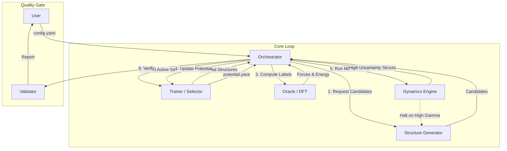

# System Architecture: PYACEMAKER (MLIP Pipeline)

## 1. Summary
The **PYACEMAKER** project is an automated system for constructing and operating Machine Learning Interatomic Potentials (MLIP) using the Atomic Cluster Expansion (ACE) formalism. Its primary goal is to democratize high-accuracy atomistic simulations by enabling users with minimal expertise to generate "State-of-the-Art" potentials.

The system addresses the traditional bottlenecks of MLIP construction: manual iteration, data inefficiency, and lack of physical robustness. By integrating a "Zero-Config" workflow with Active Learning, PYACEMAKER autonomously explores chemical space, detects high-uncertainty regions, performs Density Functional Theory (DFT) calculations, and updates the potential on-the-fly.

Central to the architecture is an **Orchestrator** that manages a feedback loop between four key components: **Structure Generator** (Explorer), **Oracle** (Labeler/DFT), **Trainer** (Learner/Pacemaker), and **Dynamics Engine** (Consumer/MD). This design ensures that the potential is not just "fitted" to static data but "evolved" through dynamic exploration, guaranteeing stability even in rare or high-energy configurations.

## 2. System Design Objectives

### 2.1. Goals
*   **Zero-Config Workflow**: Users provide a single `config.yaml` file (defining elements and basic constraints), and the system handles the entire lifecycle from initial sampling to final deployment.
*   **Data Efficiency**: Achieve RMSE < 1 meV/atom with 1/10th the DFT cost of random sampling by using Active Learning (D-Optimality and Uncertainty Quantification).
*   **Physics-Informed Robustness**: Enforce core-repulsion via Delta Learning (LJ/ZBL baselines) to prevent unphysical atomic overlap during high-energy MD events.
*   **Scalability**: Support seamless transition from local workstation prototyping to HPC-scale production runs using containerized components.

### 2.2. Constraints
*   **Dependency Management**: Must interface with external binaries (Quantum Espresso, LAMMPS, Pacemaker) robustly, handling version differences and execution failures gracefully.
*   **Resource Management**: Efficiently manage computational resources, preventing job crashes from stalling the entire pipeline (Self-Healing Oracle).
*   **Traceability**: Every potential version must be traceable back to the specific training set and configuration used to generate it.

### 2.3. Success Criteria
*   **Automation**: Complete the full active learning loop (Explore -> Label -> Train -> Validate) without human intervention.
*   **Stability**: The final potential must run stable MD simulations at high temperatures without segmentation faults (ensured by Hybrid Potentials).
*   **Accuracy**: Validation metrics (Phonon spectra, Elastic constants, EOS) must match DFT references within acceptable error margins.

## 3. System Architecture

The system follows a modular **Micro-Component Architecture** orchestrated by a central Python controller.

### 3.1. Component Diagram



### 3.2. Data Flow
1.  **Exploration**: The `Dynamics Engine` runs MD. If the extrapolation grade ($\gamma$) exceeds a threshold, it halts and returns the "dangerous" structure. Alternatively, the `Structure Generator` proposes new random/heuristic structures.
2.  **Selection**: The `Trainer` (acting as Selector) uses D-Optimality to select the most informative structures from the candidates, minimizing redundancy.
3.  **Labeling**: The `Oracle` (DFT Manager) computes precise energy, forces, and stresses for the selected structures. It handles self-correction for convergence failures.
4.  **Training**: The `Trainer` fits the ACE potential to the accumulated dataset, using Delta Learning to enforce physical baselines.
5.  **Validation**: The `Validator` runs physical checks (Phonons, Elasticity) to ensure the potential is not just numerically accurate but physically meaningful.

## 4. Design Architecture

The codebase is structured around **Abstract Base Classes (ABCs)** and **Pydantic Models** to ensure type safety and extensibility.

### 4.1. File Structure

```ascii
src/mlip_autopipec/
├── domain_models/          # Pydantic Models (Data Layer)
│   ├── config.py           # GlobalConfig, ComponentConfigs
│   ├── structure.py        # Structure, Dataset
│   ├── potential.py        # Potential, ExplorationResult
│   └── validation.py       # ValidationResult
├── interfaces/             # Abstract Base Classes
│   ├── oracle.py           # BaseOracle
│   ├── trainer.py          # BaseTrainer
│   ├── dynamics.py         # BaseDynamics
│   ├── generator.py        # BaseStructureGenerator
│   ├── validator.py        # BaseValidator
│   └── selector.py         # BaseSelector
├── infrastructure/         # Implementations
│   ├── oracle/             # QE, VASP, Mocks
│   ├── trainer/            # Pacemaker, Mocks
│   ├── dynamics/           # LAMMPS, EON, Mocks
│   ├── generator/          # Random, Heuristic
│   └── validator/          # Phonon, Elasticity
├── orchestrator/           # Logic Layer
│   └── simple_orchestrator.py
├── factory.py              # Dependency Injection
└── main.py                 # CLI Entrypoint
```

### 4.2. Key Abstractions
*   **`BaseOracle`**: Defines `compute(structures: Iterable[Structure]) -> Iterator[Structure]`. Responsible for turning atomic positions into Forces/Energy.
*   **`BaseTrainer`**: Defines `train(dataset: Iterable[Structure], base_potential: Optional[Potential]) -> Potential`. Handles the interface to `pace_train`.
*   **`BaseDynamics`**: Defines `run(potential: Potential, start_struct: Structure) -> ExplorationResult`. Handles MD execution and uncertainty monitoring.
*   **`GlobalConfig`**: A monolithic Pydantic model that validates the entire `config.yaml` at startup, ensuring all paths and parameters are valid before execution begins.

## 5. Implementation Plan (6 Cycles)

The project is strictly divided into 6 implementation cycles to ensure incremental delivery and testing.

### **CYCLE 01: Core Framework & Mocks**
*   **Goal**: Establish the "Skeleton" of the system. Run the full Orchestrator loop using Mock components that simulate work without external binaries.
*   **Features**:
    *   Define all ABCs and Pydantic Domain Models.
    *   Implement `GlobalConfig` with discriminated unions.
    *   Implement `MockOracle`, `MockTrainer`, `MockDynamics`, etc.
    *   Implement `SimpleOrchestrator` to drive the loop.
    *   Setup Logging and CLI structure.

### **CYCLE 02: Data Management & Structure Generation**
*   **Goal**: Implement real data handling and structure generation logic.
*   **Features**:
    *   Implement `StructureGenerator` with strategies: Random, Rattle, Supercell.
    *   Implement file-based Database management (JSONL/Pickle) to handle growing datasets efficiently.
    *   Implement `BaseSelector` logic (Random/Greedy) to filter candidates.
    *   **Verify**: Can generate valid atomic structures and save/load them.

### **CYCLE 03: The Oracle (DFT Automation)**
*   **Goal**: Connect to real physics engines (Quantum Espresso via ASE).
*   **Features**:
    *   Implement `DFTManager` (Real Oracle).
    *   Implement `Quantum Espresso` input generation (Self-consistent loop).
    *   Implement Self-Healing logic (auto-adjust mixing beta on failure).
    *   Implement `PeriodicEmbedding` for extracting clusters from MD snapshots.
    *   **Verify**: Can run a real `pw.x` calculation (or mocked binary) and parse forces.

### **CYCLE 04: The Trainer (Pacemaker Integration)**
*   **Goal**: Connect to the machine learning engine (Pacemaker).
*   **Features**:
    *   Implement `PacemakerWrapper` (Real Trainer).
    *   Implement Delta Learning configuration (LJ/ZBL baseline generation).
    *   Implement Active Set selection (MaxVol algorithm wrapper).
    *   **Verify**: Can train a valid `.yace` potential from a dataset.

### **CYCLE 05: The Dynamics Engine (Inference & OTF)**
*   **Goal**: Enable Active Learning via MD.
*   **Features**:
    *   Implement `MDInterface` (LAMMPS wrapper).
    *   Implement `pair_style hybrid/overlay` generation for stability.
    *   Implement Uncertainty Watchdog (`fix halt` on high gamma).
    *   Implement the "Halt & Diagnose" loop to extract high-uncertainty frames.
    *   **Verify**: MD runs and halts correctly when uncertainty spikes.

### **CYCLE 06: Validation, Integration & Orchestration**
*   **Goal**: Final Quality Assurance and full system integration.
*   **Features**:
    *   Implement `Validator` with real physics checks (Phonons via Phonopy, Elastic Constants).
    *   Finalize `Orchestrator` to handle real components and error recovery.
    *   Polish `main.py` CLI for user experience.
    *   **Verify**: Full end-to-end execution of the Fe/Pt on MgO scenario.

## 6. Test Strategy

### 6.1. Unit Testing
*   Each component (Oracle, Trainer, etc.) must be tested in isolation using **Mocks**.
*   **Pytest** fixtures will provide sample `Structure` and `Config` objects.
*   Use `unittest.mock` to simulate external binary calls (`subprocess.run`) to ensure code logic handles return codes and stdout parsing correctly without needing the actual heavy binaries in CI.

### 6.2. Integration Testing
*   **Cycle 01**: Verify the Orchestrator loop completes using Mocks.
*   **Cycle 03**: Verify `DFTManager` correctly generates input files and parses output files (using pre-generated static outputs).
*   **Cycle 05**: Verify LAMMPS input generation produces valid scripts.

### 6.3. End-to-End (E2E) Testing
*   **Mock Mode**: Run the full pipeline with `config.yaml` set to use Mocks. This validates the data flow and logic.
*   **Simulation Mode**: Use "Light" parameters (tiny cutoff, few epochs) to run the real pipeline on a small system (e.g., Al bulk) to ensure binary integration works.

### 6.4. User Acceptance Testing (UAT)
*   **Tutorials**: Jupyter Notebooks will serve as UATs.
*   **Scenario**: Fe/Pt on MgO (Deposition & Ordering).
*   **Verification**: The notebooks must run successfully in "CI Mode" (Mock/Light) and produce physically reasonable results in "User Mode".
