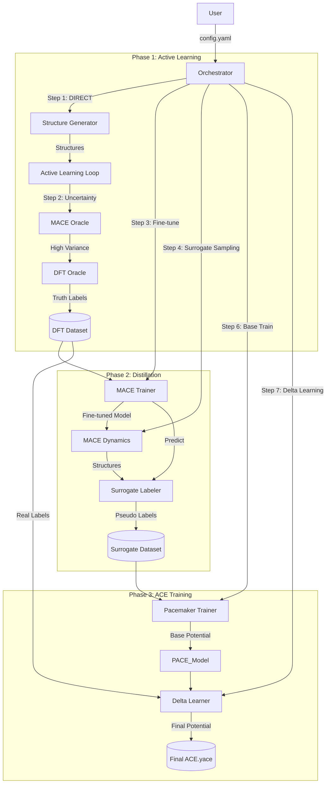

# System Architecture: PYACEMAKER (MACE Distillation Edition)

## 1. Summary
**PYACEMAKER** is a next-generation automated pipeline for constructing Machine Learning Interatomic Potentials (MLIP). It is designed to solve the "data efficiency" problem in potential development by integrating **MACE Knowledge Distillation** as its core architecture.

The primary goal is to generate high-accuracy Polynomial Potentials (ACE/Pacemaker) with minimal First-Principles (DFT) computational cost. Traditional methods require thousands of DFT calculations, which are computationally expensive and time-consuming. PYACEMAKER overcomes this by leveraging a pre-trained Large Foundation Model (MACE-MP) as a "teacher" to guide the exploration of the chemical space.

The system implements a novel **7-Step Distillation Workflow**:
1.  **DIRECT Sampling**: Maximizing entropy in the descriptor space to find diverse initial structures.
2.  **Uncertainty-based Active Learning**: Using MACE's uncertainty to select only the most critical structures for DFT validation.
3.  **MACE Fine-tuning**: Adapting the teacher model to the specific system using sparse DFT data.
4.  **Surrogate Generation**: Using the fine-tuned MACE to run high-temperature MD and sample extensive configurations.
5.  **Surrogate Labeling**: Labeling the extensive dataset with the MACE model (quasi-ground truth).
6.  **Pacemaker Base Training**: Training a fast ACE potential on the large surrogate dataset.
7.  **Delta Learning**: Fine-tuning the ACE potential with the high-precision DFT data to correct systematic errors (Real-to-Sim gap).

This architecture ensures that the final ACE potential inherits the generalizability of MACE and the accuracy of DFT, while running at the speed of polynomial potentials suitable for large-scale MD simulations.

## 2. System Design Objectives

### 2.1. Minimization of DFT Cost
**Goal:** Drastically reduce the number of required DFT calculations.
**Constraint:** The system must use MACE as a surrogate oracle whenever possible.
**Success Criteria:**
- Achieve production-level accuracy (RMSE Energy < 2 meV/atom) with fewer than 200 DFT calculations for a binary system.
- Effective use of "Uncertainty Quantification" to trigger DFT only for high-variance structures.

### 2.2. Robust Automation (Zero-Config)
**Goal:** A fully automated "Input-to-Potential" pipeline.
**Constraint:** No manual intervention during the 7-step process.
**Success Criteria:**
- The `orchestrator` must handle the transition between steps (e.g., from Active Learning to Fine-tuning) automatically.
- Idempotency: The pipeline can resume from any step if interrupted.

### 2.3. High-Performance Surrogate
**Goal:** Efficiently distill knowledge from MACE to ACE.
**Constraint:** The surrogate generation (MD) must be stable and diverse.
**Success Criteria:**
- MACE MD simulations must not crash due to unphysical atomic overlaps (handled by adaptive time-stepping or soft-core potentials).
- The resulting ACE potential must be at least 100x faster than the MACE model while maintaining >95% of its accuracy within the sampled domain.

### 2.4. Extensibility & Modularity
**Goal:** Modular design to support future descriptors or models.
**Constraint:** Interfaces must be abstract (e.g., `BaseOracle`, `BaseTrainer`).
**Success Criteria:**
- Ability to switch the DFT code (VASP/QE) or the Teacher Model (MACE/CHGNet) via configuration only.

## 3. System Architecture

The system follows a centralized **Orchestrator** pattern, controlling specialized workers for Generation, Evaluation (Oracle), and Training.

### 3.1. Component Diagram


```mermaid
graph TD
    User[User] -->|config.yaml| Orch[Orchestrator]

    subgraph "Phase 1: Active Learning"
        Orch -->|Step 1: DIRECT| Gen[Structure Generator]
        Gen -->|Structures| AL[Active Learning Loop]
        AL -->|Step 2: Uncertainty| MACE_O[MACE Oracle]
        MACE_O -->|High Variance| DFT[DFT Oracle]
        DFT -->|Truth Labels| DB[(DFT Dataset)]
    end

    subgraph "Phase 2: Distillation"
        Orch -->|Step 3: Fine-tune| MACE_T[MACE Trainer]
        DB --> MACE_T
        MACE_T -->|Fine-tuned Model| MACE_MD[MACE Dynamics]
        Orch -->|Step 4: Surrogate Sampling| MACE_MD
        MACE_MD -->|Structures| Label[Surrogate Labeler]
        MACE_T -->|Predict| Label
        Label -->|Pseudo Labels| S_DB[(Surrogate Dataset)]
    end

    subgraph "Phase 3: ACE Training"
        Orch -->|Step 6: Base Train| PACE_T[Pacemaker Trainer]
        S_DB --> PACE_T
        PACE_T -->|Base Potential| PACE_Model

        Orch -->|Step 7: Delta Learning| Delta[Delta Learner]
        DB -->|Real Labels| Delta
        PACE_Model --> Delta
        Delta -->|Final Potential| Final_ACE[(Final ACE.yace)]
    end
```

### 3.2. Data Flow
1.  **Configuration**: User provides elements and settings in `config.yaml`.
2.  **Exploration**: `StructureGenerator` creates an initial pool via DIRECT sampling (entropy maximization).
3.  **Active Learning**: `MaceSurrogateOracle` evaluates uncertainty. High-uncertainty structures are sent to `DFTOracle` (VASP/QE). Resulting data is stored in `dft_dataset.pckl`.
4.  **Teacher Improvement**: `MaceTrainer` fine-tunes the MACE model using `dft_dataset.pckl`.
5.  **Student Generation**: The improved MACE model runs MD (`DynamicsEngine`) to generate thousands of diverse structures.
6.  **Labeling**: The MACE model assigns energy/forces to these structures, creating `surrogate_dataset.pckl`.
7.  **Base Training**: `PacemakerTrainer` trains an ACE potential on `surrogate_dataset.pckl`.
8.  **Delta Correction**: `PacemakerTrainer` performs Delta Learning, using `dft_dataset.pckl` to correct the ACE potential's residuals, ensuring DFT-level accuracy.

## 4. Design Architecture

The system is built on Python 3.10+ using Pydantic for data validation and loose coupling interfaces.

### 4.1. File Structure
```text
src/pyacemaker/
├── core/
│   ├── interfaces.py       # Abstract Base Classes (BaseOracle, BaseTrainer)
│   ├── config.py           # Pydantic Configuration Models
│   └── utils.py            # Helper functions
├── domain_models/          # Data Transfer Objects (DTOs)
│   ├── structure.py        # StructureData, Dataset
│   └── metrics.py          # ValidationMetrics, UncertaintyData
├── oracle/
│   ├── dft.py              # VASP/QE Interface
│   └── mace_oracle.py      # MACE Inference & Uncertainty
├── generator/
│   ├── direct.py           # DIRECT Sampling Logic
│   └── sampler.py          # Random/MD Sampling
├── trainer/
│   ├── mace_trainer.py     # MACE Fine-tuning Wrapper
│   └── pacemaker.py        # ACE Training & Delta Learning
├── modules/
│   ├── dynamics_engine.py  # MD Engine (ASE/LAMMPS)
│   └── active_learner.py   # Query Strategy Logic
└── orchestrator.py         # Main Pipeline Controller
```

### 4.2. Class Overview
-   **`Orchestrator`**: The state machine. It tracks the current step (1-7) and invokes the appropriate modules. It persists state to `pipeline_state.json` for crash recovery.
-   **`MaceSurrogateOracle`**: Wraps the MACE model. Provides methods `predict_with_uncertainty(atoms)` and `predict_batch(atoms_list)`.
-   **`StructureGenerator`**: Implements the DIRECT algorithm to sample the descriptor space (e.g., SOAP or ACE descriptors) sparsely.
-   **`PacemakerTrainer`**: A wrapper around the `pacemaker` CLI/library. It handles `input.yaml` generation, training execution, and the complex "Delta Learning" weighting logic.

### 4.3. Data Models
-   **`CycleResult`**: Captures the output of each pipeline step (e.g., number of structures added, validation error).
-   **`StructureMetadata`**: Pydantic model attached to `ase.Atoms.info`, tracking provenance (generation method, label source).

## 5. Implementation Plan

The development is divided into 6 sequential cycles.

### **Cycle 01: Core Infrastructure & MACE Integration**
-   **Goal**: Establish the project skeleton, configuration system, and MACE interface.
-   **Features**:
    -   Basic `Orchestrator` shell.
    -   Pydantic config parsing (`config.yaml`).
    -   `MaceSurrogateOracle` (Basic loading and prediction).
    -   `BaseOracle` and `BaseTrainer` interfaces.

### **Cycle 02: DIRECT Sampling & Active Learning (Steps 1 & 2)**
-   **Goal**: Implement the "smart" initial sampling and active learning loop.
-   **Features**:
    -   `StructureGenerator` with DIRECT sampling (or simplified entropy maximization).
    -   `MaceSurrogateOracle` uncertainty quantification (variance/ensemble).
    -   `DFTOracle` (Mock implementation for CI).
    -   Step 1 & 2 logic in `Orchestrator`.

### **Cycle 03: MACE Fine-tuning & Surrogate Generation (Steps 3 & 4)**
-   **Goal**: Enable the "Teacher" model to learn and generate data.
-   **Features**:
    -   `MaceTrainer`: Logic to fine-tune MACE on DFT data.
    -   `DynamicsEngine`: Running MD with MACE to sample phase space.
    -   Step 3 & 4 logic in `Orchestrator`.

### **Cycle 04: Surrogate Labeling & Pacemaker Base Training (Steps 5 & 6)**
-   **Goal**: Create the "Student" dataset and train the base ACE model.
-   **Features**:
    -   `MaceSurrogateOracle`: Batch labeling capability.
    -   `PacemakerTrainer`: Basic ACE training functionality.
    -   Step 5 & 6 logic in `Orchestrator`.

### **Cycle 05: Delta Learning & Full Orchestration (Step 7)**
-   **Goal**: Implement the critical Delta Learning step and connect the full loop.
-   **Features**:
    -   `PacemakerTrainer`: Delta Learning implementation (mixing/weighting datasets).
    -   Full end-to-end orchestration (Steps 1-7).
    -   State persistence and recovery.

### **Cycle 06: Optimization, Validation & UAT**
-   **Goal**: Verify the system against the SN2 Reaction scenario and optimize performance.
-   **Features**:
    -   `Validator` module (Phonons, EOS).
    -   Final code polish and documentation.
    -   Execution of `UAT_AND_TUTORIAL.py` (SN2 Reaction).

## 6. Test Strategy

### 6.1. Unit Testing
-   **Framework**: `pytest`.
-   **Scope**: Individual classes (`StructureGenerator`, `MaceSurrogateOracle`).
-   **Mocking**: MACE models and DFT codes will be mocked to ensure tests run in seconds.

### 6.2. Integration Testing
-   **Scope**: Interaction between `Orchestrator` and modules.
-   **Data Flow**: Verify that structures generated in Step 1 are correctly passed to Step 2, etc.

### 6.3. User Acceptance Testing (UAT)
-   **Scenario**: SN2 Reaction (Transition State reproducibility).
-   **Method**: A single `marimo` notebook (`tutorials/UAT_AND_TUTORIAL.py`) that runs the full pipeline in "Mock Mode" (for CI) and "Real Mode" (for actual verification).
-   **Verification**: The system must successfully identify the transition state region and improve the potential's accuracy there.
