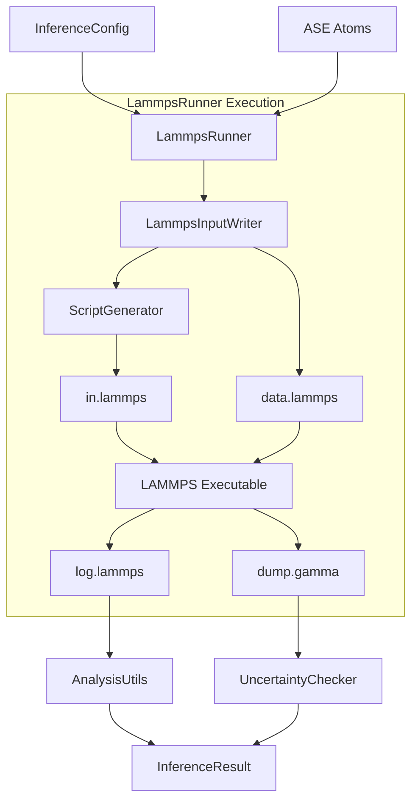

# Inference Module Architecture

The `inference` module enables the execution of Molecular Dynamics (MD) simulations using LAMMPS to validate and stress-test the machine learning potential.

## Component Interaction

1.  **Configuration**: The user provides an `InferenceConfig` (defined in `config/schemas/inference.py`), specifying temperature, pressure, potential path, and elements.
2.  **Input Generation**: The `LammpsRunner` initializes a `LammpsInputWriter`. This writer uses `ScriptGenerator` (`inputs.py`) to create the `in.lammps` script dynamically based on the config. It also uses `ase.io.write` to create the `data.lammps` file from the input structure.
3.  **Execution**: The `LammpsRunner` (`lammps_runner.py`) launches the LAMMPS executable via `subprocess`. It monitors the execution and logs output.
4.  **Uncertainty Quantification**: During execution, LAMMPS is configured to dump frames where the extrapolation grade $\gamma$ exceeds a threshold. The `UncertaintyChecker` (`uq.py`) can be used to parse these dump files and extract high-uncertainty structures for active learning.
5.  **Analysis**: Post-execution, `AnalysisUtils` (`analysis.py`) parses the `log.lammps` file to extract thermodynamic statistics (Temperature, Pressure).

## Flow Diagram

